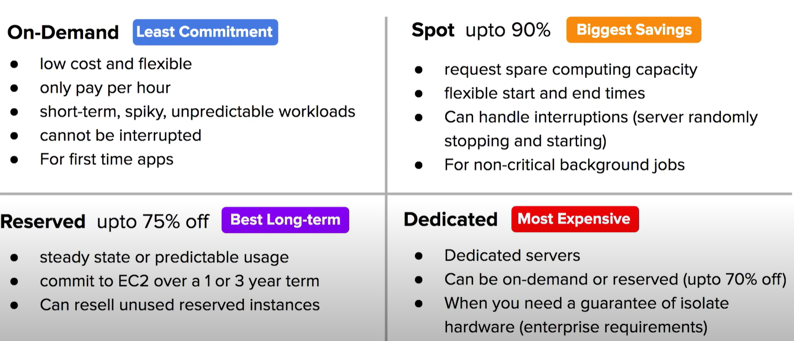
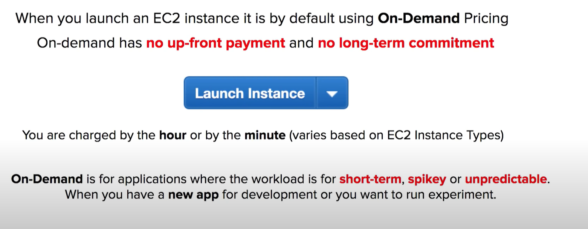
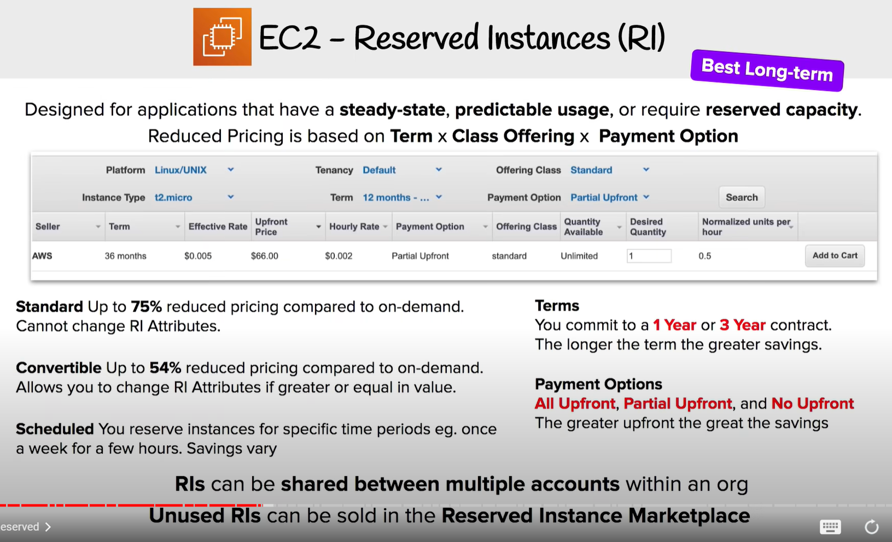
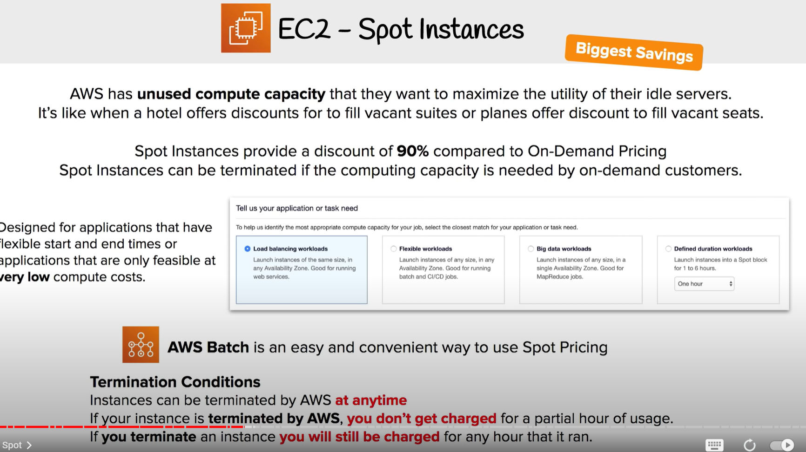
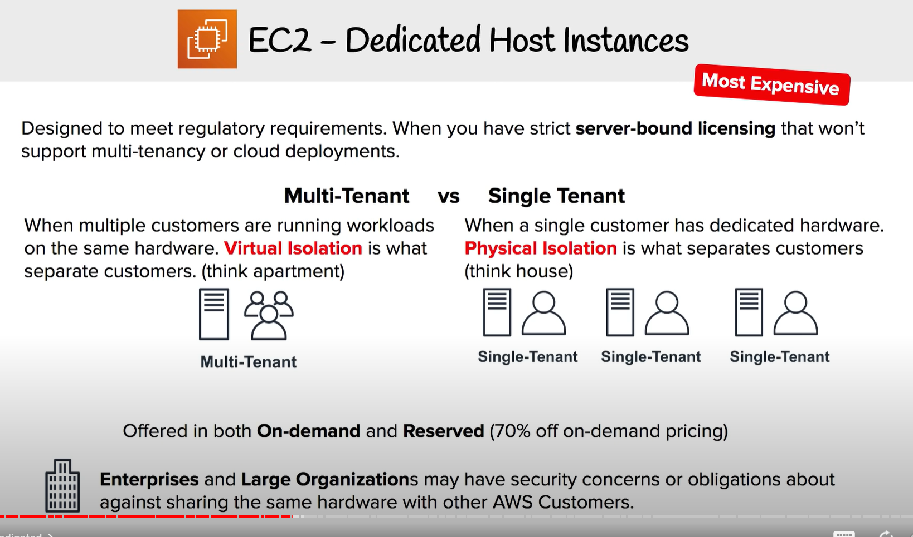
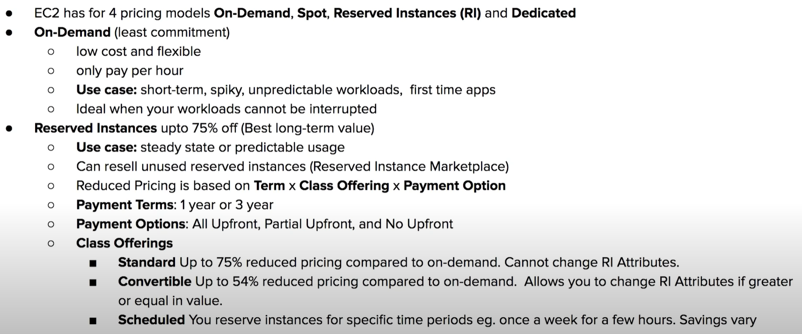
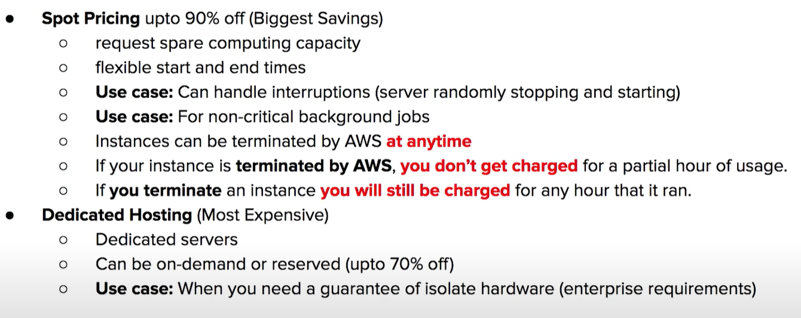

7:49:09 EC2 Pricing Models
7:51:18 On Demand instance
7:52:51 Reserved instance (RI)
7:56:07 RI Attributes
7:57:02 Regional and Zonal RI
7:58:18 RI Limits
7:59:24 Capacity Reservations
8:00:38 Standard vs Convertible RI
8:01:45 RI Marketplace
8:03:00 Spot instance
8:04:20 Dedicated instance
8:06:14 Savings Plan

# 1 Introduction

**On-Demand** (Least Commitment)
-   Low cost and flexible
-   Only pay per hour
-   Short-term, spiky, unpredictable workloads
-   Cannot be interrupted
-   For first-time apps

**Reserved** up to 75% off (Best Long-term)
-   Steady-state or predictable usage
-   Commit to EC2 over a 1 or 3 year
-   Can resell unused reserved instances

**Spot** up to 90% (Biggest Savings)
-   Request spare computing capacity
-   Flexible start and end times
-   Can handle interruptions (server randomly stopping and starting)
-   For non-critical background jobs

**Dedicated** (Most Expensive)
-   Dedicated servers
-   Can be on-demand or reserved (up to 75% off)
-   When you need a guarantee of isolate hardware (enterprise requirements)

AWS saving Plan
除了上面的四种 , 还有 aws saving paln is another way to save but can be used for more then just EC2 

# 2 On-Demand Instances 

[Amazon EC2 On-Demand Pricing](https://aws.amazon.com/ec2/pricing/on-demand/)
[New – Per-Second Billing for EC2 Instances and EBS Volumes](https://aws.amazon.com/blogs/aws/new-per-second-billing-for-ec2-instances-and-ebs-volumes/)
[On-Demand Instances](https://docs.aws.amazon.com/AWSEC2/latest/UserGuide/ec2-on-demand-instances.html)

On-Demand is a Pay-As-You-Go (PAYG) model, where you consume compute and then you pay.
When you launch an EC2 instance it is by default [On-Demand](https://docs.aws.amazon.com/AWSEC2/latest/UserGuide/ec2-on-demand-instances.html) Pricing  默认状态下 就是 用 On-Demand pricing model 

**Key Points:**
-   On-Demand has `no up-front payment` and `no long-term commitment`
-   You are charged by the **hour** or by the **minute** (varies based on EC2 Instance Types

per-second for:
-   Linux, Windows, Windows with SQL Enterprise, Windows with SQL Standard, and Windows with SQL Web Instances that do not have a separate hourly charge

per-hour:
-   full hour for all other instance types.

When looking up pricing it will always show EC2 pricing is the hourly rate
-   On-Demand is for applications where the workload is for **short-term, spikey,** or **unpredictable.**
-   Used for when you have a **new app** for development or you want to run an experiment

# 3 Reserved Instances (RI)

[Amazon EC2 Reserved Instances](https://aws.amazon.com/ec2/pricing/reserved-instances/)
[Types of Reserved Instances (offering classes)](https://docs.aws.amazon.com/AWSEC2/latest/UserGuide/reserved-instances-types.html)

Designed for applications that have a steady-state, predictable usage, or require reserved capacity.
Reduced Pricing is based on <mark>Term x Class Offering x RI Attributes x Payment Option</mark>

**Terms** - You commit to a 1 year or 3-year contract. The longer the term the greater savings
- You commit to a 1 Year or 3 Year contract.
- Reserved Instances do not renew automatically
- When they expire your instance will use On-Demand with no interruption to service. 过期后 自动转成 on-Demand instance 

---
**Class** — The less flexible the greater the savings
- **Standard:** Up to **75%** reduced pricing compared to on-demand. You can modify RI Attributes.
- **Convertible:** Up to **54%** reduced pricing compared to on-demand. You can exchange RI based on RI Attributes if greater or equal in value.
- **Scheduled:** AWS no longer offers Scheduled RI

---
**Payment Options** — The greater upfront the great the savings
- **All Upfront**
    - Full payment is made at the start of the term
- **Partial Upfront**
    - A portion of the cost must be paid upfront and the remaining hours in the term are billed at a discounted hourly rate
- **No Upfront**
    - You are billed a discounted hourly rate for every hour within the term, regardless of whether the Reserved Instance is being used
        -  `RIs` can be shared between multiple accounts within an organization
        -   `Unused RIs` can be sold in the **Reserved Instance Marketplace**.

## 3.1 RI Attributes
7:56:07 RI Attributes

RI Attributes (aka Instance Attributes) are limited based on Class Offering and can affect the final price of an RI instance. 

There are 4 RI Attributes:
1. Instance type: For example, m4.large. This is composed of the instance family (for example, m4) and the instance size (for example, large).
2. Region: The Region in which the Reserved Instance is purchased.
3. Tenancy: Whether your instance runs on shared (default) or single-tenant (dedicated) hardware.
4. Platform: The operating system eg. Windows or Linux/Unix. 

## 3.2 Regional and Zonal RI
7:57:02 Regional and Zonal RI

[Regional and zonal Reserved Instances (scope)](https://docs.aws.amazon.com/AWSEC2/latest/UserGuide/reserved-instances-scope.html)
[Work with Capacity Reservations](https://docs.aws.amazon.com/AWSEC2/latest/UserGuide/capacity-reservations-using.html)

When you purchase a RI, you determine the **scope** of the Reserved Instance.
The scope **does not affect the price**.  这两项 都不影响 价格 

**Regional RI**: purchase for a Region
- does not reserve capacity.
- RI discount applies to instance usage in any AZ in the Region.
- RI discount applies to instance usage within the instance family, regardl ess of size. Only supported on Amazon Linux/Unix Reserved Instances with default tenancy.
- You can queue purchases for regional RI

**Zonal RI**: purchase for an Availability Zone
- reserves capacity in the specified Availability Zone.
- RI discount applies to instance in the selected AZ (No AZ Flexibility)
- No instance size flexibility
- RI discounts discount applies to instance usage for the specified instance type and size only.
- You can't queue purchases for zonal RI

## 3.3 RI Limits
7:58:18 RI Limits

[Reserved Instances](https://docs.aws.amazon.com/AWSEC2/latest/UserGuide/ec2-reserved-instances.html)

There is a limit to the number of Reserved Instances that you can purchase per month.

**Per month** you can purchase
-   **20** Regional Reserved Instances per Region
-   **20** Zonal Reserved Instances per AZ

**Regional Limits**
You cannot exceed your running On-Demand Instance limit by purchasing regional Reserved Instances. The default On-Demand Instance limit is 20.
Before purchasing RI ensure your On-Demand limit is equal to or greater than your RI you intend to purchase

**Zonal Limits**
You can exceed your running On-Demand Instance limit by purchasing zonal Reserved Instances
If you already have 20 running On-Demand Instances, and you purchase 20 zonal Reserved Instances, you can launch a further 20 On-Demand Instances that match the specifications of your zonal Reserved Instances

## 3.4 Capacity Reservations
7:59:24 Capacity Reservations

[Work with Capacity Reservations](https://docs.aws.amazon.com/AWSEC2/latest/UserGuide/capacity-reservations-using.html)

EC2 instances are backed by a different kind of hardware, and so there is a **finite amount of servers** available within an Availability Zone per instance type or family.
You go to launch a specific type of EC2 instance but AWS has run out of that server!

**Capacity Reservation** is a service of EC2 that allows you to **request a reserve of EC2 instance type** for a specific Region and AZ

The reserved capacity is charged at the selected instance type’s On-Demand rate whether an instance is running in it or not.
You can also use your regional reserved instances with your Capacity Reservations to benefit from billing discounts

## 3.5 Standard vs Convertible RI
8:00:38 Standard vs Convertible RI

[Types of Reserved Instances (offering classes)](https://docs.aws.amazon.com/AWSEC2/latest/UserGuide/reserved-instances-types.html)
[Modify Reserved Instances](https://docs.aws.amazon.com/AWSEC2/latest/UserGuide/ri-modifying.html)

There are some key differences between Standard and Convertible

**Standard RI**
RI attributes can be modified
-   Change the AZ within the same Region
-   Change the scope of the Zonal RI to Regional RI or visa versa
-   Change the instance size (Linux/Unix only, default tenancy )
-   Change network from Ec2-Classic to VPC and visa-versa

Can't be exchanged
Can be bought or sold in the RI Marketplace

---

**Convertible RI**
~~RI attributes can’t be modified (you perform an exchange)~~ RI attributes **CAN** be modified
Can be exchanged during the term for another Convertible RI with new RI attributes, including:
-   instance family
-   instance type
-   platform
-   scope
-   tenancy

Can't be bought or sold in the RI Marketplace

## 3.6 RI Marketplace
8:01:45 RI Marketplace

EC2 Reserved Instance Marketplace allows you to **sell your unused Standard RI** to recoup your RI spend for RI you do not intend or cannot use.
-   Reserved Instances can be sold after they have been active for at least 30 days and once AWS has received the upfront payment (if applicable).
-   You must have a US bank account to sell Reserved Instances on the Reserved Instance Marketplace.
-   There must be at least one month remaining in the term of the Reserved Instance you are listing.
-   You will retain the pricing and capacity benefit of your reservation until it's sold and the transaction is complete.
-   Your company name (and address upon request) will be shared with the buyer for tax purposes.
-   A seller can set only the upfront price for a Reserved Instance. The usage price and other configuration (e.g., instance type, Availability Zone, platform) will remain the same as when the Reserved Instance was initially purchased.
-   The term length will be rounded down to the nearest month. For example, a reservation with 9 months and 15 days remaining will appear as 9 months on the Reserved Instance Marketplace.
-   You can sell up to $20,000 in Reserved Instances per year. If you need to sell more Reserved Instances.
-   Reserved Instances in the GovCloud region cannot be sold on the Reserved Instance Marketplace.

# 4 Spot Instances

AWS has unused compute capacity that they want to maximize the utility of their idle servers.
It’s like when a hotel offers booking discounts to fill vacant suites or planes offer discounts to fill vacant seats

[Amazon EC2 Spot Instances](https://aws.amazon.com/ec2/spot/) provide a discount of 90% compared to On-Demand Pricing
Spot Instances can be terminated if the computing capacity is needed by other On-Demand customers
Amazon EC2 Spot Instances let you take advantage of **unused EC2 capacity** in the AWS cloud.
Designed for applications that have flexible start and end times or applications that are only feasible at **very low** compute costs.

[AWS Batch](https://aws.amazon.com/batch/) is an easy and convenient way to use Spot Pricing

**Termination Conditions:**
-   Instances can be terminated by AWS **at any time.**  可能随时被中断 
-   If your instance is terminated by AWS, **you don't get charged** for a partial hour of usage.
-   If you terminate an instance **you will still be charged** for an hour that it ran.

# 5 Dedicated Host Instance 
[Amazon EC2 Dedicated Instances](https://aws.amazon.com/ec2/pricing/dedicated-instances/)

Can be untilized / offerd  (Multi-Tenant vs Single Tenant)  in On-Demand Instances and Reserved Instances (up to 70% off)

[Dedicated Host Instances](https://aws.amazon.com/ec2/dedicated-hosts/) are designed to meet regulatory requirements.

When you have strict server-bound licensing that won’t support multi-tenancy or cloud deployments you use Dedicated Hosts.

**Multi-tenant:** (Think of everyone living in an apartment)
    - When multiple customers are running workloads on the same hardware. **Virtual Isolation** is what separate customers ( Like a multi-tenant apartment)

**Single Tenant:** (Think of everyone having their own house)
- When a single customer has dedicated hardware. **Physical Isolation** is what separates customers( Like a single-family home)
    -   Most expensive
    -   Use when you have strict **server-bound licensing** that won't support multi-tenancy or cloud deployments

Dedicated can be offered for:
-   On-demand
-   Reserved (up to 60% savings)
-   Spot (up to 90% savings)

**Enterprises** and **Large Organizations** my have security concerns or obligations against sharing the same hardware with other AWS Customers

# 6 Savings Plan
8:06:14 Savings Plan

**Savings Plans** offer you similar discounts as Reserved Instances (RI) **but simplifies the purchasing process**

AWS Savings Plan has 3 different savings types:
- ****Compute Savings Plans** **
    - Compute Savings Plans provide the most flexibility and help to reduce your costs by up to 66%. These plans automatically apply to EC2 instance usage, AWS Fargate, and AWS Lambda service usage regardless of instance family, size, AZ, region, OS, or tenancy.
- **EC2 Instance Savings Plans**
    - provide the lowest prices, offering savings up to 72% in exchange for commitment to usage of individual instance families in a region. automatically reduces your cost on the selected instance family in that region regardless of AZ, size, OS or tenancy. give you the flexibility to change your usage between instances within a family in that region.
- **SageMaker Savings Plan**
    - Helps you reduce SageMaker costs by up to 64%. automatically apply to SageMaker usage regardless of instance family, size, component, or AWS region.

You can choose two different terms
-   **1 Year**
-   **3 Year**

You choose the following Payment Options:
-   All Upfront
-   Partial Upfront
-   No Upfront

# 7 EC2 Pricing CheatSheet

-   **[EC2 has 4 pricing models](https://aws.amazon.com/ec2/pricing/)**
    1.  On-Demand
    2.  Spot
    3.  Reserved Instances (RI)
    4.  Dedicated

-   **[On-Demand](https://aws.amazon.com/ec2/pricing/on-demand/)** (Least commitment) (默认的 就是 这个 , 为标准的价格 )
    -   Low cost and flexible
    -   Only pay per hour
    -   Use Case: short-term, spiky, unpredictable workloads, and first time apps
    -   Ideal when your workloads cannot be interrupted.
-   **[Reserved Instances](https://aws.amazon.com/ec2/pricing/reserved-instances/)**- up to 75% off (Best long-term value)
    -   **Use case:** steady state or predictable usage
    -   Can resell unused reserved instances (Reserved Instance Marketplace)
    -   Reduced Pricing is based on **Term x Class Offering x Payment Option**
    -   **Payment Terms:** 1 year or 3 years
    -   **Payment Options:** All Upfront, Partial Upfront, No Upfront
    -   **Class Offerings:**
        -   `Standard:` Up to 75% reduced pricing compared to on-demand. ~~Cannot change RI attributes~~ **Some attributes can be modified**
        -   `Convertible:` Up to 54% reduced pricing compared to on-demand. ~~Allows you to change RI Attributes if greater than or equal in value.~~ **Some attributes can be modified**
        -   ~~Scheduled: You reserve instances for specific times periods. Savings vary.~~ **NOTE: You cannot purchase Scheduled Reserved Instances at this time. AWS does not have any capacity available for Scheduled Reserved Instances or any plans to make it available in the future.**
-   **[Spot Pricing](https://aws.amazon.com/ec2/spot/)**- up to 90% off (Biggest Savings)
    -   Request spare computing capacity
    -   Flexible start and end times
    -   **Use case:** Can handle interruptions like a server randomly stopping and starting
    -   **Use case:** For non-critical background jobs
    -   Instances can be terminated by AWS **at anytime**
    -   If your instance is **terminated by AWS**, `you don't get charged` for a partial hour of usage.
    -   If **you terminate** an instance `you will still be charged` for any hour that it ran.
-   **[Dedicated Hosting](https://aws.amazon.com/ec2/dedicated-hosts/)** (Most Expensive)
    -   Dedicated servers
    -   Can be on-demand or reserved (up to 70% off)
    -   **Use case**: When you need a guarantee of isolated hardware (enterprise requirements)

Resources: [Scheduled Reserved Instances](https://docs.aws.amazon.com/AWSEC2/latest/UserGuide/ec2-scheduled-instances.html)

