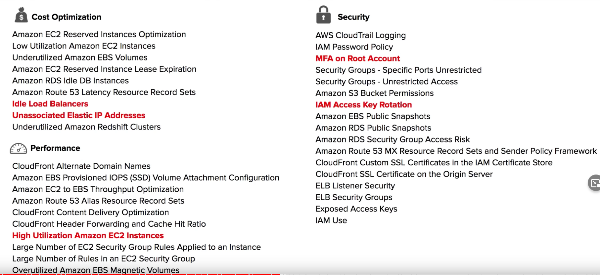

11:30:35 AWS Free Services
11:31:32 AWS Support Plans
11:36:17 Technical Account Manager
11:38:04 AWS Support Follow Along
11:45:27 AWS Marketplace
11:46:26 AWS Marketplace Follow Along
11:47:41 Consolidated Billing
11:49:07 Consolidated Billing Volume Discounts
11:50:38 AWS Trusted Advisor
11:53:47 AWS Trusted Advisor Follow Along
11:58:29 SLAs
11:59:57 AWS SLA Examples
12:02:48 AWS SLA Follow Along
12:03:23 Service Health Dashboard
12:04:03 AWS Personal Health Dashboard
12:04:56 AWS Abuse
12:06:32 AWS Abuse Report Follow Along
12:07:14 AWS Free Tier
12:10:09 AWS Credits
12:11:06 AWS Partner Network
12:13:28 AWS Budgets
12:15:10 AWS Budget Reports
12:15:44 AWS Cost and Usage Reports
12:16:49 Cost Allocation Tags
12:17:37 Billing Alarms
12:18:24 AWS Cost Explorer
12:19:45 AWS Cost Explorer Follow Along
12:22:03 Programmatic Pricing APIs
12:23:06 AWS Savings Plan Follow Along

# 1 Free Services
那些服务是免费的

AWS Free services are free forever, unlike the “free-tier” that are up to a point of usage or time
The AWS services are also free. However these AWS Services provision other services which may cost money

-   **IAM - Identity Access Management**
-   **Amazon VPC**
-   **Auto Scaling**
-   **CloudFormation**
-   **Elastic Beanstalk**
-   Opsworks
-   Amplify
-   AppSync
-   CodeStar
-   Organizations & Consolidated Billing
-   AWS Cost Explorer

# 2 AWS Support Plans

aws 人员会帮助你, 帮你解答 问题, 
Third party support: like Django, rails 

 Follow Along - Lets create a support case

# 3 Technical Account Manager
11:36:17 Technical Account Manager

[Technical Account Manager](https://www.amazon.jobs/en/jobs/1316212/technical-account-manager)
[What is the role of a Technical Account Manager? Meet our ANZ Team](https://www.youtube.com/watch?v=bWwlNaF6Jw8a)

**A Technical Account Manager? (TAM)** provides both **proactive guidance and reactive support** to help you succeed with your AWS journey

What does a TAM do? (Straight from an AWS Job Posting)
-   Build solutions, provide technical guidance and advocate for the customer
-   Ensure AWS environments remain operationally healthy whilst reducing cost and complexity
-   Develop trusting relationships with customers, understanding their business needs and technical challenges
-   Using your technical acumen and customer obsession, you’ll drive technical discussions regarding incidents, trade-offs, and risk management
-   Consult with a range of partners from developers through to C-suite executives
-   Collaborates with AWS Solutions Architects, Business Developers, Professional Services Consultants, and Sales Account Managers
-   Proactively find opportunities for customers to gain additional value from AWS
-   Provide detailed reviews of service disruptions, metrics, detailed prelaunch planning
-   Being part of a wider Enterprise Support team providing post-sales, consultative expertise
-   Solve a variety of problems across different customers as they migrate their workloads to the cloud
-   Uplift customer capabilities by running workshops, brown bag sessions, etc.

TAMs follow the Amazon Leadership Principles Especially about being Customer Obsessed!
TAMs are only available at the Enterprise Support tier.

# 4 AWS infrastructure event management

https://aws.amazon.com/premiumsupport/programs/iem/
AWS Infrastructure Event Management (IEM) offers architecture and scaling guidance and operational support during the preparation and execution of planned events, such as shopping holidays, product launches, and migrations. For these events, AWS Infrastructure Event Management will help you assess operational readiness, identify and mitigate risks, and execute your event confidently with AWS experts by your side. The program is included in the Enterprise Support plan and is available to Business Support customers for an additional fee.

# 5 AWS Support Follow Along
11:38:04 AWS Support Follow Along

Createa asupport vases 

Change Support Plan 

create a new support case in teachnical Support

case history 

# 6 AWS Marketplace

[What is AWS Marketplace?](https://docs.aws.amazon.com/marketplace/latest/userguide/what-is-marketplace.html)

**AWS Marketplace** is a curated digital catalog with **thousands** of software listings from independent software vendors.
Easily find, buy, test, and deploy software that already runs on AWS.

The product can be **free** to use or can have an **associated charge**. The charge becomes part of your AWS bill, and once you pay, AWS Marketplace pays the provider.

The sales channel for ISVs and Consulting Partners allows you to **sell your solutions** to other AWS customers.

Products can be offered as
-   Amazon Machine Images (AMIs)
-   AWS CloudFormation templates
-   Software as a service (SaaS) offerings
-   Web ACL
-   AWS WAF rules

3.1 Follow Along - Marketplace subscription

# 7 Consolidated Billing (多个 account 一起付钱)
11:47:41 Consolidated Billing
11:49:07 Consolidated Billing Volume Discounts

[Consolidated billing for AWS Organizations](https://docs.aws.amazon.com/awsaccountbilling/latest/aboutv2/consolidated-billing.html)

**Consolidated Billing** is a feature of AWS Organizations that allows you to pay for multiple AWS accounts with **one bill**.
For billing, AWS treats all the accounts in an organization as if they were one account.
You can designate one **master account** **that pays the charges** of all the other **member accounts**.
Consolidated billing is offered at no additional cost!

Use **Cost Explorer** to visualize usage for consolidated billing
You can combine the usage across all accounts in the organization to share the volume pricing discounts

## 7.1 Volume Discounts
[Consolidated billing for AWS Organizations](https://docs.aws.amazon.com/awsaccountbilling/latest/aboutv2/consolidated-billing.html)

AWS has **Volume Discounts** for many services
The more you use, the more you save.
Consolidated Billing lets you take advantage of Volume Discounts
Consolidate Billing is a feature of AWS Organizations

Data Transfer
First 10TB | $0.17 per GB  
Next 40 TB | $0.13 per GB

1TB = 1024 GB

**Odo** (4 * 1024) * 0.17 = $696.32  
**Dax** (8 * 1024) * 0.17 = $1392.64  
**Unconsolidated** 696.32+1392.64 = $2088.96  
**Consolidated** ((10 * 1024) * 0.17)+((2 * 1024) * 0.13) = $2007.04

# 8 AWS Trusted Advisor

11:50:38 AWS Trusted Advisor
11:53:47 AWS Trusted Advisor Follow Along

**AWS Trusted Advisor** is a **recommendation tool** that automatically and actively monitors your AWS account to provide **actional recommendations** across a series of categories.

**Think of AWS Trusted Advisor like an automated checklist of best practices on AWS**

The 5 categories of AWS Trusted Advisor
-   Cost Optimization – How can we save money?
-   Performance – How can we improve performance?
-   Security – How can we improve security?
-   Fault Tolerance – How can we prevent a disaster or data loss?
-   Service Limits – Are we going to hit the maximum limit for a service?

 

---

AWS Trusted Advisor provides different levels of checks based on your AWS Support Plan

Basic
-   7 Trusted Advisor Checks

Developer
-   7 Trusted Advisor Checks

Business
-   All Trusted Advisor Checks
    -   Includes the 5 check categories
    -   You can use the AWS Support API and AWS CLI to access your checks

Enterprise
-   All Trusted Advisor Checks
    -   Includes the 5 check categories
    -   You can use the AWS Support API and AWS CLI to access your checks

AWS provides the following six security checks for free:
-   MFA on Root Account
-   Security Groups – Specific Ports of Unrestricted
-   Amazon S3 Bucket Permissions
-   Amazon EBS Public Snapshots
-   Amazon RDS Public Snapshots
-   IAM Use -  discourage the use of root access
-   Service Limits (All Service limits checks are free)

---

这个 Advisor 并不是真人, 而是 一种服务. 告诉你在 topic 下面, 你可以优化什么

**Cost Optimization**

-   Amazon EC2 Reserved Instances Optimization
-   Low Utilization Amazon EC2 Instances
-   Underutilized Amazon EBS Volumes
-   Amazon EC2 Reserved Instance Lease Expiration
-   Amazon RDS Idle DB Instances
-   Amazon Route 53 Latency Resource Record Sets
-   Idle Load Balancers
-   Unassociated Elastic IP Addresses
-   Underutilized Amazon Redshift Clusters

**Performance**

-   CloudFront Alternate Domain Names
-   Amazon EBS Provisioned IOPS (SSD) Volume Attachment Configuration
-   Amazon EC2 to EBS Throughput Optimization
-   Amazon Route 53 Alias Resource Record Sets
-   CloudFront Content Delivery Optimization
-   CloudFront Header Forwarding and Cache Hit Ratio
-   High Utilization Amazon EC2 Instances
-   Large Number of EC2 Security Group Rules Applied to an Instance
-   Large Number of Rules in an EC2 Security Group
-   Overutilized Amazon EBS Magnetic Volumes

**Security**

-   AWS CloudTrail Logging
-   IAM Password Policy
-   MFA on Root Account
-   Security Groups - Specific Ports Unrestricted
-   Security Groups - Unrestricted Access
-   Amazon S3 Bucket Permissions
-   IAM Access Key Rotation
-   Amazon EBS Public Snapshots
-   Amazon RDS Public Snapshots
-   Amazon RDS Security Group Access Risk
-   Amazon Route 53 MX Resource Record Sets and Sender Policy Framework
-   CloudFront Custom SSL Certificates in the IAM Certificate Store
-   CloudFront SSL Certificate on the Origin Server
-   ELB Listener Security
-   ELB Security Groups
-   Exposed Access Keys
-   IAM Use

**Fault Tolerance**

-   Amazon EBS Snapshots
-   Amazon RDS Multi-AZ
-   Amazon S3 Bucket Logging
-   Amazon S3 Bucket Versioning
-   Amazon Aurora DB Instance Accessibility
-   Amazon EC2 Availability Zone Balance
-   Amazon RDS Backups
-   Amazon Route 53 Deleted Health Checks
-   Amazon Route 53 Failover Resource Record Sets
-   Amazon Route 53 High TTL Resource Record Sets
-   Amazon Route 53 Name Server Delegations
-   Auto Scaling Group Health Check
-   Auto Scaling Group Resources
-   ELB Connection Draining
-   ELB Cross-Zone Load Balancing
-   Load Balancer Optimization
-   VPN Tunnel Redundancy
-   AWS Direct Connect Connection Redundancy
-   AWS Direct Connect Location Redundancy
-   AWS Direct Connect Virtual Interface Redundancy
-   EC2Config Service for EC2 Windows Instances
-   ENA Driver Version for EC2 Windows Instances
-   NVMe Driver Version for EC2 Windows Instances
-   PV Driver Version for EC2 Windows Instances

**Service Limits**

-   Auto Scaling Groups
-   Auto Scaling Launch Configurations
-   CloudFormation Stacks
-   DynamoDB Read Capacity
-   DynamoDB Write Capacity
-   EBS Active Snapshots
-   EBS Active Volumes
-   EBS Cold HDD (sc1) Volume Storage
-   EBS General Purpose SSD (gp2) Volume Storage
-   EBS Magnetic (standard) Volume Storage
-   EBS Provisioned IOPS (SSD) Volume Aggregate IOPS
-   EBS Provisioned IOPS SSD (io1) Volume Storage
-   EBS Throughput Optimized HDD (st1) Volume Storage
-   EC2 Elastic IP Addresses
-   EC2 On-Demand Instances
-   EC2 Reserved Instance Leases
-   ELB Active Load Balancers
-   IAM Group
-   IAM Instance Profiles
-   IAM Policies
-   IAM Roles
-   IAM Server Certificates
-   IAM Users
-   Kinesis Shards per Region
-   RDS Cluster Parameter Groups
-   RDS Cluster Roles
-   RDS Clusters
-   RDS DB Instances
-   RDS DB Parameter Groups
-   RDS DB Security Groups
-   RDS DB Snapshots Per User
-   RDS Event Subscriptions
-   RDS Max Auths per Security Group
-   RDS Option Groups
-   RDS Read Replicas per Master
-   RDS Reserved Instances
-   RDS Subnet Groups
-   RDS Subnets per Subnet Group
-   RDS Total Storage Quota
-   Route 53 Hosted Zones
-   Route 53 Max Health Checks
-   Route 53 Reusable Delegation Sets
-   Route 53 Traffic Policies
-   Route 53 Traffic Policy Instances
-   SES Daily Sending Quota
-   VPC
-   VPC Elastic IP Address
-   VPC Internet Gateways

⌨️ (1:54:13) Follow Along Trusted Advisor

# 9 Service Level Agreements SLAs

11:58:29 SLAs

**What is a Service Level Agreement (SLA)?**
An SLA is a **formal commitment** about the **expected level of service** between a customer and provider.
When a service level is not met and if the Customer meets its obligations under the SLA, Customer will be eligible to receive the compensation eg. **Financial or Service Credits**

**What is a Service Level Indicator (SLI)?**
A **metric/measurement** that indicates what measure of performance a customer is receiving at a given time
An SLI metric could be uptime, performance, availability, throughput, latency, error rate, durability, correctness

**What is a Service Level Objective (SLO)?**
The objective that the provider has agreed to meet
SLOs are represented as a specific **target percentage** over a period of time.

**Availability SLA of 99.99% in a period of 3 months**

Target percentages
-   99.95%
-   99.99%
-   99.999999999% (commonly called **Nine nines**)
-   99.99999999999% (commonly called ~~Nine elevens~~ **Eleven nines**)

## 9.1 AWS SLA Examples
11:59:57 AWS SLA Examples

[AWS Service Level Agreements (SLAs)](https://aws.amazon.com/legal/service-level-agreements/)
[Amazon DynamoDB Service Level Agreement](https://aws.amazon.com/dynamodb/sla/)
[Amazon Compute Service Level Agreement](https://aws.amazon.com/compute/sla/)

满足不了 SLA 中服务, 就会退你一部分钱 
In the event Amazon RDS does not meet the Monthly Uptime Percentage commitment, you will be eligible to receive a Service Credit as described below.

## 9.2 **DynamoDB SLA**
AWS will use commercially reasonable efforts to make DynamoDB available with a Monthly Uptime Percentage for each AWS region, during any monthly billing cycle, of (a) at least 99.999% if the Global Tables SLA applies, or (b) at least 99.99% if the Standard SLA applies

In the event DynamoDB does not meet the Service Commitment, you will be eligible to receive a Service Credit as described below

**Monthly Uptime Percentage**

**Service Credit Percentage**

Global Tables SLA
Less than 99.999% but equal to or greater than 99.0%, Less than 99.0% but equal to or greater than 95.0%, Less than 95.0%
10%, 25%, 100%

Standard SLA
Less than 99.99% but equal to or greater than 99.0%, Less than 99.0% but equal to or greater than 95.0%, Less than 95.0%
10%, 25%, 100%

## 9.3 **Compute SLAs**

-   Amazon Elastic Compute Cloud (Amazon EC2)*
-   Amazon Elastic Block Store (Amazon EBS)
-   Amazon Elastic Container Service (Amazon ECS)
-   AWS Fargate for Amazon ECS and Amazon EKS

AWS makes two SLA commitments for the Included Services:
1.  a Region-Level SLA that governs Included Services deployed across multiple AZs or regions, and
2.  an Instance-Level SLA that governs Amazon EC2 instances individually. 

**Monthly Uptime Percentage**
**Service Credit Percentage**

Region-Level SLA
Less than 99.99% but equal to or greater than 99.0%, Less than 99.0% but equal to or greater than 95.0%, Less than 95.0%
10%, 30%, 100%

Instance-Level SLA
Less than 99.5% but equal to or greater than 99.0%, Less than 99.0% but equal to or greater than 95.0%, Less than 95.0%
10%, 30%, 100%

## 9.4 **RDS SLA**

AWS will use commercially reasonable efforts to make Multi-AZ instances available with a Monthly Uptime Percentage of at least 99.95% during any monthly billing cycle

In the event Amazon RDS does not meet the Monthly Uptime Percentage commitment, you will be eligible to receive a Service Credit as described below.

**Monthly Uptime Percentage**
**Service Credit Percentage**

Less than 99.95% but equal to or greater than 99.0%, Less than 99.0% but equal to or greater than 95.0%, Less than 95.0%
10%, 25%, 100%

## 9.5 AWS SLA Follow Along
12:02:48 AWS SLA Follow Along

# 10 Service Health Dashboard
12:03:23 Service Health Dashboard
[AWS Personal Health Dashboard](https://aws.amazon.com/premiumsupport/technology/personal-health-dashboard/)

The Service Health Dashboard shows the general status of AWS services,
An icon and details will indicate the status of each AWS Service

## 10.1 AWS Personal Health Dashboard (针对你个人的)
12:04:03 AWS Personal Health Dashboard
[Automating processes for handling and remediating AWS Abuse alerts](https://aws.amazon.com/blogs/mt/automating-processes-for-handling-and-remediating-aws-abuse-alerts/)

[AWS Personal Health Dashboard](https://aws.amazon.com/premiumsupport/technology/personal-health-dashboard/)

**AWS Personal Health Dashboard** provides **alerts and guidance** for AWS events that might affect your environment. 

All AWS customers can access the Personal Health Dashboard. 
The Personal Health Dashboard shows recent events to help you manage active events, and shows proactive notifications so that you can plan for scheduled activities
Use these alerts to get notified about changes that can affect your AWS resources, and then follow the guidance to diagnose and resolve issues.

# 11 AWS Abuse (骚扰行为)
12:04:56 AWS Abuse

[Automating processes for handling and remediating AWS Abuse alerts](https://aws.amazon.com/blogs/mt/automating-processes-for-handling-and-remediating-aws-abuse-alerts/)
[How do I report abuse of AWS resources?](https://aws.amazon.com/premiumsupport/knowledge-center/report-aws-abuse/)
[Report Amazon AWS abuse](https://support.aws.amazon.com/#/contacts/report-abuse)

AWS Support does not deal with Abuse tickets. You need to contact [abuse@amazonaws.com](mailto:abuse@amazonaws.com) or fill out the Report Amazon AWS abuse form.

**AWS Trust & Safety** is a team that specifically deals with abuses occurring on the AWS platform for the following issues:

**Spam**
You are receiving unwanted emails from an AWS-owned IP address, or AWS resources are used to spam websites or forums.

**Port scanning**
Your logs show that one or more AWS-owned IP addresses are sending packets to multiple ports on your server. You also believe this is an attempt to discover unsecured ports.

**Denial-of-service (DoS) attacks**
ow that one or more AWS-owned IP addresses are used to flood ports on your resources with packets. You also believe that this is an attempt to overwhelm or crash your server or the software running on your server.

**Intrusion attempts:**
Your logs show that one or more AWS-owned IP addresses are used to attempt to log in to your resources.

**Hosting prohibited content:**
You have evidence that AWS resources are used to host or distribute prohibited content, such as illegal content or copyrighted content without the consent of the copyright holder.

**Distributing malware**
You have evidence that AWS resources are used to distribute software that was knowingly created to compromise or cause harm to computers or machines that it's installed on.

## 11.1 AWS Abuse Report Follow Along
12:06:32 AWS Abuse Report Follow Along

# 12 AWS Free Tier
12:07:14 AWS Free Tier

[AWS Free Tier](https://aws.amazon.com/free/)

AWS has a free-tier that allows you to use AWS at no cost
-   for the first 12 months of signup
-   Or free usage up to a certain monthly limit forever

Best Deals *
一个月 < 750 小时

**EC2** Web Server *
-   **t2.micro** 750 hours per month for 1 year

**RDS** Database (MySQL or Postgres) *
-   t2.db.micro 750 hours per month for 1 year

**ELB** Load Balancer *
-   750 hours per month for 1 year

**Amazon CloudFront**  Homepage Video
-   50 GB data-transfer out in total for 1 year

**Amazon Connect** Toll-Free Number
-   90 minutes of call-time per month for 1 year

**Amazon ElastiCache** Caching
-   cache.t3.micro 750 hours per month for 1 year

**Amazon ElasticSearch Service** Full-Text Search
-   750 hours per month for 1 year 

**PinPoint** Campaign / Marketing Emails
-   5,000 targeted users per month for 1 year

**SES** Emails sent by your web-application
-   62,000 emails per month forever

**AWS CodePipeline** CI/CD
-   1 Pipeline free

**AWS CodeBuild** Building Code
-   100 build minutes per month forever

**AWS Lambda** Serverless Compute
-   1M free request per month
-   3.2M seconds of compute time per month

# 13 AWS Credits
12:10:09 AWS Credits

[AWS credits](https://docs.aws.amazon.com/awsaccountbilling/latest/aboutv2/useconsolidatedbilling-credits.html)

**AWS Promotional Credits** (or AWS Credits for short) are the equivalent to USD dollars on the AWS platform. AWS Credits can be earned in several ways:
-   Joining the AWS Activate startup program
-   Winning Hackathons
-   Participating in Surveys
-   …

AWS Credits generally have an expiry date attached to them.
AWS Credits can be used for most services but there are exceptions where AWS Credits cannot be used eg. Purchasing a domain via Route53

# 14 AWS Partner Network
12:11:06 AWS Partner Network

[AWS Partner Network](https://aws.amazon.com/partners/)
[Why AWS Partner Network Badges Matter for Customers and APN Partners](https://aws.amazon.com/blogs/apn/why-aws-partner-network-badges-matter-for-customers-and-apn-partners/)
[AWS Consulting Partners](https://aws.amazon.com/partners/consulting/)

假如他 近视加入 一个 aws expert 的 社区 , 和他人联系, build your own bussiness

The AWS Partner Network (APN) is a global partner program for AWS. Joining the APN will open your organization up to business opportunities and allow exclusive training and marketing events

When joining the APN you can either be a:
Consulting Partner – you help companies utilize AWS  
Technology Partner – you build technology on top of AWS as a service offering

-   A partner belongs to a specific Tier: Select, Advanced, or Premier
-   Different tiers have different Annual fee commitments
-   Different tiers have different Knowledge requirements
    -   AWS Certification
    -   AWS APN-Exclusive Certifications
-   You can get back Promotional AWS Credits
-   You can have unique speaking opportunities in the official AWS marketing channels. Eg blogs, webinars
-   Being part of the APN is a requirement to be a Sponsor with a vendor booth at AWS Events

# 15 AWS Budgets

12:13:28 AWS Budgets

**AWS Budgets** give you the ability to set up alerts if you **exceed** or are **approaching** your defined budget
报警, 当超过你预定的预算的时候 

Create **Cost, Usage, or Reservation** Budgets
It can be tracked at the **monthly, quarterly, or yearly levels**, with customizable start and end dates
Alerts support **EC2, RDS, Redshift, and ElastiCache** reservations.

AWS Budgets can be used to Forecast costs but is limited compared to Cost Explorer or doing your analysis with AWS Cost and Usage Reports along with a Business Intelligence tool
Budget based on a fixed cost or plan your upfront based on your chosen level
Can be easily managed from the **AWS Budgets** dashboard or via the **Budgets API**.

Get Notified by providing an email or **Chatbot** and threshold how close to the current or forecasted budget

使用Budgets 功能 你要付的费用: 
-   **first two** budgets are **free** of charge
-   Each budget is **$0.02** per day **~0.60 USD / month**
-   **20,000** budgets limit

You have a list of budgets:
You can see your budget history, download it as a CSV

## 15.1 AWS Budget Reports
12:15:10 AWS Budget Reports

AWS Budget Report is used alongside AWS Budgets to create and send daily, weekly, or monthly reports to monitor the performance of your AWS Budget that will be emailed to specific emails.

AWS Budget Reports serve as a more convenient way of staying on top of reports since they are delivered to your email instead of logging into the AWS Management Console

## 15.2 AWS Budgets Follow Along

# 16 AWS Cost and Usage Report
用这个服务可以生成一个 csv, 里面有 关于 花费的情况 .  
这个csv  必须导入到 S3,  然后 利用 aws 中的 其他功能 可以将 这个 表 视觉化出来 
[Amazon EC2 Reserved Instances](https://aws.amazon.com/ec2/pricing/reserved-instances/)

Generate a **detailed spreadsheet**, enabling you to better **analyze and understand your AWS costs**

Places the reports into S3
Use Athena to turn the report into a queryable database
Use QuickSight to visualize your billing data as graphs

Choose the granularity of your data by selecting hourly, daily, or monthly
The report will contain Cost Allocation Tags
CUR data is stored in a CSV (GZIP) or Parquet format in your selected S3 bucket

## 16.1 例子 

生成的 excel 自动存在 s3 中 

# 17 Cost Allocation Tags

12:16:49 Cost Allocation Tags
[Using Cost Allocation Tags](https://docs.aws.amazon.com/awsaccountbilling/latest/aboutv2/cost-alloc-tags.html)

**Cost Allocation Tags** are optional metadata that can be attached to AWS resources so when you generate a Cost and Usage Report you can use that data to better analyze your data.

There are **two types** of tags:
-   User-Defined
    -   Eg Project
-   AWS Generated
    -   E.g. aws:createdBy

You have to **activate** the tags you want to show up in the report

# 18 Billing Alerts/Alarms
12:17:37 Billing Alarms

You can create your own Alarms in CloudWatch Alarms to monitor spending. They are commonly called “Billing Alarms”

You first need to turn on **Billing Alerts**
To create a CloudWatch Alarm and you can choose Billing as your Metric
Billing Alarms are much more flexible than AWS Budgets and ideal for more complex use-cases for monitoring spending and usage

# 19 AWS Cost Explorer

对应的服务是 aws cost management 

[AWS Cost Explorer](https://aws.amazon.com/aws-cost-management/aws-cost-explorer/)

**AWS Cost Explorer** lets you **visualize, understand, and manage** your AWS costs and usage **over time**.

1 界面介绍

Specific type range and aggregation
Robust filtering

Default reports help you gain insight into your cost drivers and usage trends.

Use **forecasting** to get an idea of future costs

2 
Choose if you want to view your data at a **monthly** or **daily** level of granularity

Use **filter** and **grouping** functionalities to dig even deeper into your data!

Cost Explorer shows up in **US-East-1**, 其他区域不能使用 

## 19.1 AWS Cost Explorer Follow Among

What is "EC2-Other" filter in "Cost Explorer" dashboard mean? 
https://stackoverflow.com/questions/56869952/what-is-ec2-other-filter-in-cost-explorer-dashboard-mean

Costs for EC2-Other include things such EBS, Data transfer, Load Balancers, etc.
If you'd really want to check internally what you're being charged for, go to "Cost Explorer", select the monthly cost report, filter on the right the "EC2-Other" service, and group by "Usage Type"

## 19.2 billing Dashboard

# 20 Programmatic Pricing APIs
12:22:03 Programmatic Pricing APIs

用 api 的方式 获取 prcing info 

With AWS you can programmatically access pricing information to get the latest price offering for services.

There are two versions of this API:
-   Query API – The Pricing Service API via JSON
-   [https://api.pricing.us-east-1.amazonaws.com](https://api.pricing.us-east-1.amazonaws.com)
-   Batch API – The Price List API via HTML
-   [https://pricing.us-east-1.amazonaws.com/offers/v1.0/aws/index.json](https://pricing.us-east-1.amazonaws.com/offers/v1.0/aws/index.json)

You can also subscribe to Amazon Simple Notification Service (Amazon SNS) notifications to get alerts when prices for the services change.
AWS prices change periodically, such as when AWS cuts prices when new instance types are launched, or when new services are introduced

# 21 AWS Savings Plan Follow Along
12:23:06 AWS Savings Plan Follow Along

save money 的一些建议 

购买买一个 saving plans

Recommendation 

