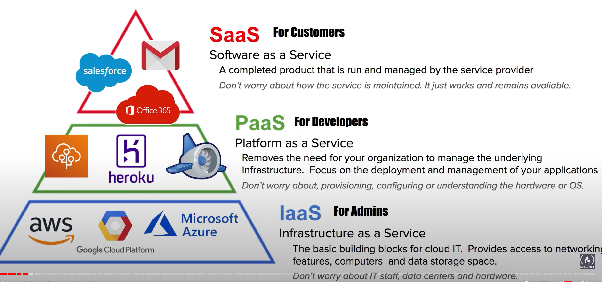
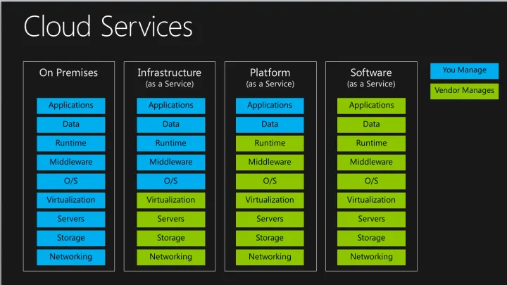

# 1 What is Cloud Computing?

cloud computing is the practice of using a network of remote servers hosted on the internet to store manage and process data rather than a local server or personal computer

The "textbook" definition of **Cloud Computing**:

**Cloud Computing** is the practice of using a network of remote servers hosted on the Internet to store, manage, and process data, rather than on a local server or personal computer.
Cloud computing allows companies or individuals to rent the resources they need for their companies or personal projects like storage space.
Companies no longer have to purchase physical hardware with expensive IT departments.
This has helped a lot of smaller companies launch their projects or services quickly.
Companies can adjust the types of services they need on demand instead of waiting weeks or longer for new servers or other equipment to scale their businesses.
Individuals no longer need a computer with a huge hard drive for photos or files. They can now store these on services like Google Drive.

## 1.1 **On-premises vs Cloud Providers**

On-premises 和 Cloud Providers的区别

On-premises
-   You own the servers
-   You hire the IT people
-   You pay or rent the real-estate
-   You take all the risk.

Cloud Providers
-   Someone else owns the servers
-   Someone else hires the IT people
-   Someone else pays or rents the real-estate
-   You are responsible for configuring your cloud services and code, someone else takes care of the rest

# 2 Type of Cloud Hosting

Dedicated Server​
- **One physical machine dedicated to single a business​**
-   Runs a single web-app/site.​
-   Very Expensive, High Maintenance, *High Security​
 
Virtual Private Server​
- **The physical machine is virtualized into sub-machines**
-   Runs multiple web-apps/sites​
-   Better Utilization and Isolation of Resources​

Shared Hosting​
- **One physical machine, shared by hundred of businesses​**
-   Relies on most tenants under-utilizing their resources.​
-   Very Cheap, Limited functionality, Poor Isolation​

Cloud Hosting​
- **Multiple physical machines that act as one system** ​
-   The system is abstracted into multiple cloud services​    
-   Flexible, Scalable, Secure, Cost-Effective, High Configurability​

# 3 What is AWS

An American multinational computer technology corporation headquartered in Seattle, Washington
Amazon was founded in 1994 by Jeff Bezos and the company started as an online store for books and expanded to other products.
Amazon has expanded beyond just online e-commerce store into:

-   cloud computing (Amazon Web Services)
-   digital streaming
    -   Amazon Prime Video
    -   Amazon Prime Music
    -   Twitch.tv
-   Grocery Stores (Whole Foods Market)
-   Artificial Intelligence
-   Low orbit satellites (Juniper Systems)
-   And more!

Andy Jassy is the current CEO of Amazon. Previously the CEO of AWS. So Jeff Bezos can focus on space travel.

Amazon is an American multinational computer technology corporation headquartered in Seattle, Washington.
Amazon was founded in 1994 by Jeff Bezos and the company started as an online store for books and expanded to other products.

Amazon many products include: - Amazon e-commerce - cloud computing - digital streaming - artificial intelligence. ​
Amazon calls their cloud provider service ​**Amazon Web Services​** (Commonly referred to just `AWS`)
`AWS` was launched in 2006 is the leading **Cloud Service Provider** in the world.​

**Simple Queue Service (SQS)** was the first AWS service launched for public use in 2004
**Simple Storage Service (S3)** was launched in March of 2006
**Elastic Compute Cloud (EC2)** was launched in August of 2006

**Note:** Cloud Service Providers can be initialized as `CSPs`

# 4 Cloud Service Provider (CSP)
Cloud Service Provider (CSP) ist a company 

Cloud Service Provider (CSP)  和 cloud platform 的区别: 
if a company offers multiple cloud services under a single ui but do not meet most or all of these requirements, it would just be referred to as a cloud platform so when you hear about twilio or hashicorp or databricks

A [**Cloud Service Provider**](https://docs.aws.amazon.com/general/latest/gr/glos-chap.html#C) - is a company which provides multiple **Cloud Services**, ​and those Cloud Services can be chained together to create cloud architectures​

Most commonly through internet-hosted computing, storage, and software services.

## 4.1 The Big Three Service Providers

There are three main cloud service providers that own the market share. These providers and their market share are:
-   Amazon Web Services (AWS) - 32.4% ($9.8B)​
-   Microsoft Azure - 7.6% ($5.3B)
-   Google Cloud Platform - 6% ($1.8B)

## 4.2 Common Cloud Services
-   **Compute​** - Imagine having a virtual computer that​ can run applications, programs, and code.
-   **Networking​** - Imagine having a virtual network that allows you to define internet connections or network isolations
-   **Storage​**- Imagine having a virtual hard-drive that​ can store files
-   **Databases​** - Imagine a virtual database for storing and reporting data or a database for general-purpose web-application

> **Note:** - AWS has over 200+ cloud services

The term **“Cloud Computing”** can be used to refer to all categories, even though it has **“compute”** in the name.

# 5 Landscape of CSPs 

**Tier-1 (Top Tier)** – Early to market, wide offering, strong synergies between services, well recognized in the industry
-   Amazon Web Services (AWS)
-   Microsoft Azure
-   Google Cloud Platform (GCP)
-   Alibaba Cloud

**Tier-2 (Mid Tier)** – Backed by well-known tech companies, slow to innovate and turned to specialization.
-   IBM Cloud
-   Oracle Cloud
-   Rackspace (OpenStack)

**Tier-3 (Light Tier)** – Virtual Private Servers (VPS) turned to offer core IaaS offering. Simple, cost-effective
-   Vultr
-   Digital Ocean
-   Linode

# 6 Gartner Magic Quadrant for Cloud

魔力象限（Magic Quadrant）是Gartner公司开发的一种图形化的市场分析工具，它是将一个特定技术市场的参与者（供应商）按照不同的市场表现放入到坐标轴的四个象限，以此来评估一个特定技术市场中的供应商和产品

# 7 Common Cloud Services 

A cloud provider can have hundreds of cloud services that are grouped into various types of services.

The four most common types of cloud services for Infrastructure as a Service (IaaS) would be:
-   **Compute​** - Imagine having a virtual computer that​ can run applications, programs, and code.
-   **Networking​** - Imagine having a virtual network that allows you to define internet connections or network isolations
-   **Storage​**- Imagine having a virtual hard drive that​ can store files
-   **Databases​** - Imagine a virtual database for storing and reporting data or a database for general-purpose web-application

> **Note:** - AWS has over 200+ cloud services

The term **“Cloud Computing”** can be used to refer to all categories, even though it has **“compute”** in the name.

Cloud Computing can be used to refer to all categories, even though it has Compute in the name

# 8 Technology Overview 
Cloud Service Provider  对应提供的 4 core cloud services: 

**Cloud Service Providers (CSPs)** that are **Infrastructure as a Service (IaaS)** will always have **4 core cloud service** offerings:
**Compute**
EC2 Virtual Machines

**Storage**
EBS Virtual Hard drives

**Database**
RDS SQL databases

**Networking and Content Delivery**
VPC Private Cloud Network

Analytics

Application Integration

AR & VR

AWS Cost Management

Blockchain

Business Applications

Containers

Customer Engagement

Developer Tools

End-User Computing

Game Tech

Internet of Things

Machine Learning

Management & Governance

Media Services

Migration & Transfer

Mobile

Quantum Technologies

Robotics

Satellites

Security, Identity & Compliance

# 9 Evolution of Computing
Dedicated Server -> Virtual Machine -> Containers -> Functions 

### 9.1.1 Dedicated
-   A physical server **​wholly utilized by a single customer**​.
-   You have to guess your capacity​
-   You’ll overpay for an underutilized server ​
-   You can’t vertical scale, you need a manual migration​
-   Replacing a server is very difficult​
-   You are limited by your Host Operating System​
-   Multiple apps can result in conflicts in resource sharing​
-   You have a **​guarantee of security, privacy, and full utility of underlying resources**​

### 9.1.2 VMs
-   You can run **​multiple Virtual Machines on one machine.**​​
-   **​Hypervisor**​ is the software layer that lets you run the VMs​
-   A physical server shared by multiple customers​
-   You are to pay for a fraction of the server​
-   You’ll overpay for an underutilized Virtual Machine ​
-   You are limited by your Guest Operating System​
-   Multiple apps on a single Virtual Machine can result in conflicts in resource sharing​
-   Easy to export or import images for migration​
-   Easy to Vertically or Horizontally scale​

### 9.1.3 Containers
-   Virtual Machine running multiple containers​
-   **​Docker Daemon**​ is the name of the software layer that lets you run multiple containers.​
-   You can maximize the utilization of the available capacity which is more cost-effective​
-   Your containers share the same underlying OS so containers are more efficient than multiple VMs​
-   Multiple apps can run side by side without being limited to the same OS requirements and will not cause conflicts during resource sharing​

### 9.1.4 Functions
-   Functions are managed VMs running managed containers.​
-   Known as **​Serverless Compute​**​
-   You upload a piece of code, choose the amount of memory and duration. ​
-   Only responsible for code and data, nothing else​
-   Very cost-effective, only pay for the time code is running, VMs only run when there is code to be executed​
-   Cold Starts is a side-effect of this setup​

1 Dedicated Server 

2 Virtual Machine

 
3 Containers
确定是 a lots of work for maintan

4 Functions
Cold Starts:  where the virtual machine has to spin up and so sometimes requests can be a bit slow so there's a bit of trade-off

# 10 Types of Cloud Computing / Cloud Computing models
如果你是一个网站站长，想要建立一个网站。不采用云服务，你所需要的投入大概是：买服务器，安装服务器软件，编写网站程序。
现在你追随潮流，采用流行的云计算，
- 如果你采用IaaS服务，那么意味着你就不用自己买服务器了，随便在哪家购买虚拟机，但是还是需要自己装服务器软件
- 而如果你采用PaaS的服务，那么意味着你既不需要买服务器，也不需要自己装服务器软件，只需要自己开发网站程序
- 如果你再进一步，购买某些在线论坛或者在线网店的服务,这意味着你也不用自己开发网站程序，只需要使用它们开发好的程序，而且他们会负责程序的升级、维护、增加服务器等，而你只需要专心运营即可，此即为SaaS。

IaaS（Infrastructure as a service – 基础设施即服务）：用户可以在云服务提供商提供的基础设施上部署和运行任何软件，包括操作系统和应用软件。用户没有权限管理和访问底层的基础设施，如服务器、交换机、硬盘等，但是有权管理操作系统、存储内容，可以安装管理应用程序，甚至是有权管理网络组件。简单的说用户使用IaaS，有权管理操作系统之上的一切功能。我们常见的IaaS服务有虚拟机、虚拟网络、以及存储。

PaaS（Platform as a service – 平台即服务）：PaaS给用户提供的能力是使用由云服务提供商支持的编程语言、库、服务以及开发工具来创建、开发应用程序并部署在相关的基础设施上。用户无需管理底层的基础设施，包括网络、服务器，操作系统或者存储。他们只能控制部署在基础设施中操作系统上的应用程序，配置应用程序所托管的环境的可配置参数。常见的PaaS服务有数据库服务、web应用以及[容器服务](https://www.zhihu.com/search?q=%E5%AE%B9%E5%99%A8%E6%9C%8D%E5%8A%A1&search_source=Entity&hybrid_search_source=Entity&hybrid_search_extra=%7B%22sourceType%22%3A%22answer%22%2C%22sourceId%22%3A743669668%7D)。成熟的PaaS服务会简化开发人员，提供完备的PC端和移动端软件开发套件（SDK），拥有丰富的开发环境（Inteli、Eclipse、VS等），完全可托管的数据库服务，可配置式的应用程序构建，支持多语言的开发，面向应用市场。

SaaS（Software as a Service – [软件即服务](https://www.zhihu.com/search?q=%E8%BD%AF%E4%BB%B6%E5%8D%B3%E6%9C%8D%E5%8A%A1&search_source=Entity&hybrid_search_source=Entity&hybrid_search_extra=%7B%22sourceType%22%3A%22answer%22%2C%22sourceId%22%3A743669668%7D)）：SaaS给用户提供的能力是使用在云基础架构上运行的云服务提供商的应用程序。可以通过轻量的客户端接口（诸如web浏览器（例如，基于web的电子邮件））或程序接口从各种客户端设备访问应用程序。 用户无需管理或控制底层[云基础架构](https://www.zhihu.com/search?q=%E4%BA%91%E5%9F%BA%E7%A1%80%E6%9E%B6%E6%9E%84&search_source=Entity&hybrid_search_source=Entity&hybrid_search_extra=%7B%22sourceType%22%3A%22answer%22%2C%22sourceId%22%3A743669668%7D)，包括网络，服务器，操作系统，存储甚至单独的应用程序功能，可能的例外是有限的用户特定应用程序配置设置。类似的服务有：各类的网盘(Dropbox、百度网盘等)，JIRA，GitLab等服务。而这些应用的提供者不仅仅是云服务提供商，还有众多的第三方提供商（ISV: independent software provider）。

There are three main models of Cloud Computing:
1.  SaaS - Software as a Service
2.  PaaS- Platform as a Service
3.  IaaS- Infrastructure as a Service

### 10.1.1 IaaS- Infrastructure as a Service (Host)
Most basic building blocks of cloud IT infrastructure. It has the most flexibility and management control of all the different cloud computing models. It is the closest to having a traditional on-premises data center.

**Examples:**

-   Amazon Web Services
-   Microsoft Azure
-   Google Cloud

### 10.1.2 PaaS- Platform as a Service (Build)
Provides a platform allowing customers to develop, run, and manage applications without the complexity of building and maintaining the infrastructure typically associated with developing and launching an app. Less flexibility than IaaS because of pre-constructed packages.

**Examples:**

-   AWS Elastic Beanstalk
-   Windows Azure
-   Heroku
-   Google App Engine

### 10.1.3 SaaS- Software as a Service (Consume)
Completed projects managed by a service provider. Easy to use and comes complete with a user interface. Least flexibility
**Examples:**
-   Gmail
-   Adobe Creative Cloud

# 11 Cloud Computing Deployment Models

Public Cloud 
Private Cloud 
Hybrid
Cross Cloud : Using Multiple Cloud Providers at same time  , aka multi-cloud, but not hybrid-cloud 

There are three different types of deployment models for Cloud Computing.
[What are public, private, and hybrid clouds?](https://docs.microsoft.com/en-us/learn/modules/fundamental-azure-concepts/types-of-cloud-computing)

Cloud: When you think of Cloud, think of small startups. 
Cloud Deployment
-   100% of IT infrastructure is on the cloud.
-   All of a companies applications were migrated to or created on the cloud.
-   Helps to remove roadblocks of costly and time consuming procurement processes for on-premises infrastructure (big servers and data centers!).
-   Great for small businesses and start-ups.

Hybrid: When you think of Hybrid, think of Fin Tech Companies 
Hybrid Deployment
-   Connects on-premises technology with cloud-based resources
-   Great for established companies that had a dedicated data center but also wants to migrate processes over to the cloud
-   Data is partially on the cloud, and partially in the on-premises
-   Popular in the Fin Tech space

On-Premise: When you think of **On-premise**, think of **large old companies** or companies that are beholden to **Government Regulations**.
On-premises(Private cloud) Deployment
-   Use virtualization to deploy resources in their on-premises data centers.
-   Resembles traditional IT infrastructure with big servers, data centers, etc.
-   Do not get the same benefits of cloud computing (ability to easily scale up and down on demand)
-   Company has dedicated resources that are not shared with others(good for security)
-   Resources cannot be accessed using the internet
-   Typically older large companies or owned by Government organizations

## 11.1 Cross-cloud

桥梁的产品: offering for a control plane for cimpute across multiple CSPs and On-premise Environments

- Anthos: google cloud platform 的产品 
- azure arc : 微软的产品
- aws:  aws has not been um cross-cloud friendly, 没有类似上面的 桥梁的产品 
- 

## 11.2 Deployment Model Use Cases

 

# 12 The Benefits of the cloud 

Benefits of the cloud  is a summary of reasons why an orgranization would consider adopting or migrating to utilizing pulic cloud 
Benefits of the cloud  is a reworking and expansion of the six advantages of cloud
The six advantage of cloud was aws original description of Cloud Benefits 

The benefits of the cloud are a summary of reasons why an organization would consider adopting or migrating to utilizing the public cloud.

-   Agility
    -   Increase speed and agility
-   Pay-as-you-go pricing
    -   Trade capital expense for variable expense
-   Economy of scale
    -   Benefit from massive economies of scale
-   Global Reach
    -   Go global in minutes
-   Security
-   Reliability
    -   Stop spending money on running and maintaining data centers
-   High Availability
-   Scalability  
    -   Stop guessing capacity
-   Elasticity

Cloud Architecture

Missing:
-   Fault Tolerance
-   Disaster Recovery

**The Benefits of Cloud is reworking and expansion of the Six Advantages of Cloud**

## 12.1 Six Advantages and Benefits of Cloud Computing over on-Premise

相关的 doc
https://docs.aws.amazon.com/whitepapers/latest/aws-overview/six-advantages-of-cloud-computing.html

1.  Trade capital expense for variable expense
2.  Benefit from massive economies
3.  Stop guessing capacity
4.  Increase speed and agility
5.  Stop spending money on running and maintaining data centers
6.  Go global in minutes

You can Pay On-Demand meaning there is no upfront cost and you pay for only what you consume or pay by the hour, minutes, or seconds.

Instead of paying for upfront costs of data centers and servers

You are sharing the cost with other customers to get unbeatable savings.

Hundreds of thousands of customers utilize a fraction of a server

Scale up or down to meet the current need. Launch and destroy services whenever

Instead of paying for idle or underutilized servers.

Launch resources within a few clicks in minutes instead of waiting days or weeks of your IT to implement the solution on-premise

Focus on your own customers, developing and configuring your applications

Instead of operations such as racking, stacking, and powering servers

Deploy your app in multiple regions around the world with a few clicks.

Provide lower latency and a better experience for your customers at a minimal cost.

## 12.2 Seven Advantages of Cloud

**Cost-effective​**
You pay for what you consume, with no up-front cost. On-demand pricing or Pay-as-you-go (PAYG) with thousands of customers sharing the cost of the resources​

**Global**
Launch workloads anywhere in the world, Just choose a region​

**Secure​**
Cloud provider takes care of physical security. Cloud services can be secure by default or you have the ability to configure access down to a granular level.​

**Reliable​**
Data backup, disaster recovery, data replication, and fault tolerance​

**Scalable​**
Increase or decrease resources and services based on demand ​

**Elastic​**
Automate scaling during spikes and drop in demand​

**Current​**
The underlying hardware and managed software are patched, upgraded, and replaced by the cloud provider without interruption to you.​

