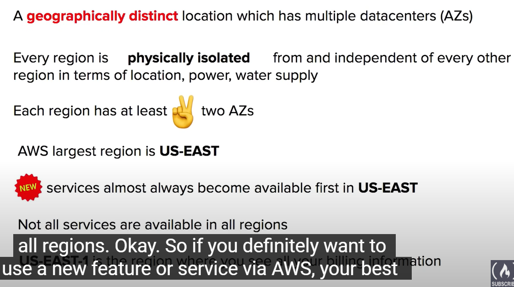
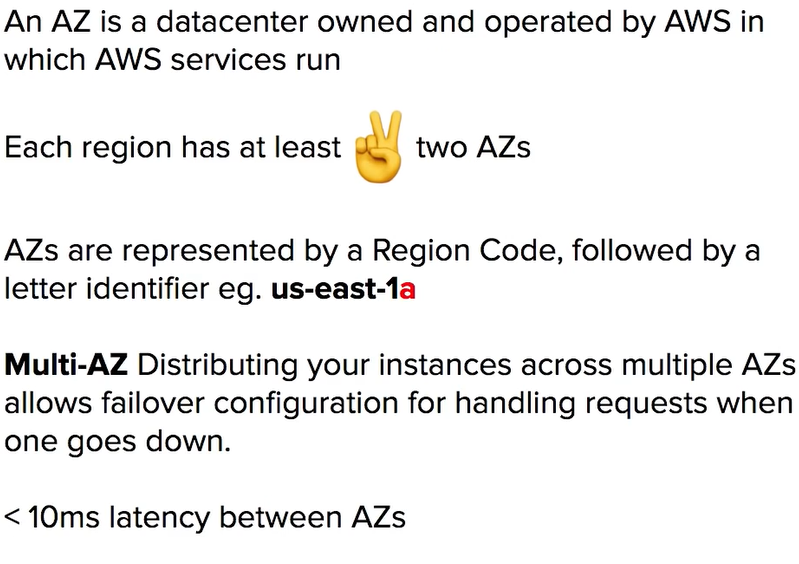

# 1 Digital Transformation

## 1.1 Innovation Waves

## 1.2 Burning platform 
Burning platform  is a term used when a company abandons old technology for new technology with the uncertainty of success and can be motivated by fear taht organization's future survival hinges on digital transformation 

## 1.3 Digital Transformation Checklist

aws 提供一个 pdf , pdf 的名字就是 Digital Transformation Checklist

## 1.4 Evolution of Computing Power

Computer Power: It's the throughput measured at which a computer can complete computational tasks

## 1.5 Amazon Braket in aws  (quantum computing )

# 2 AWS Global Infrastructure

AWS Global Infrastructure is globally distributed hardware and data centers that are physically networked together to act as one large resource for the end customers

1:33:57 AWS Global Infrastructure Overview  
1:34:52 AWS Global Infrastructure Follow Along  
1:35:45 Regions  
1:38:09 Regions vs Global Services  
1:39:57 Availability Zones (AZs)  
1:42:35 Regions vs AZ Visualized  
1:43:42 Selecting Regions and AZs Follow Along  
1:47:13 Fault Tolerance  
1:50:44 AWS Global Network  
1:52:33 Points of Presence (PoP)  
1:53:36 Tier 1  
1:54:14 AWS Services using PoPs  
1:55:29 AWS Direct Connect  
1:56:52 Direct Connect Location  
1:57:26 AWS Local Zones  
1:58:56 Wavelength Zones  
1:59:59 Data Residency  
2:02:37 AWS for Government  
2:03:25 GovCloud  
2:04:51 AWS in China  
2:06:32 AWS in China Follow Along  
2:07:30 Sustainability  
2:09:20 Sustainability Follow Along  
2:10:35 AWS Ground Station  
2:11:54 AWS Outposts

## 2.1 Introduction and  Overview

https://aws.amazon.com/about-aws/global-infrastructure/regions_az/

## 2.2 Regions, AZ, Datacenters, Subnet 之间关系 

 

### 2.2.1 Selecting Regions and AZs Follow Along  
EC2: 创建一个 ec2 instance 的时候, 需要选 az
s3: 只用选 aws region, 不需要选 az

### 2.2.2 Regions

Region 的一些常见规律: 
Each Region generally hat 3 avaiabilty Zones

Four Factors has to be condesiderd during choosing a region there 

#### 2.2.2.1 Regional Services vs Global Services  

Regional Services: AWS scopes their aws Management Console On A selected Region
Global Services : Some AWS Services operate across multiple regions and the region will be fixed to Gloabl e.g. Amazon S3 , CloudFront, Route53 , IAM 

### 2.2.3 Availability Zones
Availability Zones is physical locations made up of one or more data centers so a data center is a secured building that contains hundreds or thousands of computers

A data center is a secured building that contains hundreds or thousands of computers
A Region will generally contain three availability zones. An Availability Zones contains one or more datacenter 

#### 2.2.3.1 subnets and Availability Zones 关系 

## 2.3 Fault Tolerance  

- Fault Domain
    - A fault domain is so a fault domain is a section of a network that is vulnerable to damage if a critical device or system fails.  
    - The purpose of a fault domain is that if a failure occurs it will not cascade outside that domain limiting the possible damage
- The Scope of a fault domain
    - 
- Fault Level
    - A Fault level is a collection of fault domains 
- Fault level and Fault domain in AWS
    - 

- The Isolation of Fault level and Fault Domain 
    - Each amazon region is designed to be completely isolated from the other amazon region. they achieved this with the greatest possible fault tolerance and stability
    - Each availability zone is also isolated but the availability zone in a region are connected through low-latency links
    - Each availability zone is designed as an independent failure zone 
- Fault Zone in AWS ( = Fault Domain )
    - 
- Multi-AZ for High Availability 
    - If an application is partitioned across azs companies are better isolated and protected from issues such as power outages lightning strikes tornadoes earthquakes and more 

 

## 2.4 AWS Global Network and Edge Locations

Global network represents interconnections between aws global infrastructure
Global network  is a private Expressway, where things can move very fast between data centers 

- Edge Locations
    - Edge Location is on and off ramps (进出高速路的 辅道 ) to aws global Network 
    - On-ramp
        - use edge locations as an on-ramp to quickly reach AWS's resources and other regions by traversing the fast away global network
        - 比如 aws global accelerator , AWS s3 transfer acceleration 就是用的这样的功能那个. 
    - Off-ramp
        - Uses Edge Locations an off-ramp,  to provide an at the edge storage and compute near the end user. 
        - 比如  Amaozn CloudFront (CDN) 用的就是这个功能 
    - VPC Endpoints: Ensuring you resources stay within the AWS network and do no traverse over the public Internet 

## 2.5 Points of Presence (PoP)  

PoP 就是 a location between AWS region and the end userr. 
Pop 这个 location 就是 datacenter 
Pop 中的 resource 是 
- Edge Locations : the data Centers that hold cached on the most popular files 
- Regional Edge Locations :  the data Centers that hold much larger caches of less popluar  
- Regional Edge Caches 

### 2.5.1 Tier 1 in Network  and PoPs 储存在哪里

PoPs live at the edge/Intersection of 2 networks
Pier one networks is a network that can reach every other network on th on internet without purchasing ip transit or paying for peering 
PoPs 用来 for Content Delivery and Expediated Upload

AWS availability zones are all redundantly connected to multiple tier 1 transit providers

### 2.5.2 AWS Services using PoPs  
PoPs 用来 for Content Delivery and Expediated Upload  
将 数据 上传到 edge Location. 然后用来 方便 user 快速 从 edge location 中 访问数据

- Amazon Cloud ist a Content Delivery Network (CDN) Services 
    - Point you website toCloudFornt, 这样 当访问这个 website 的时候, 就会 route request to nearest Edge Location Cache 
    - origin (就是 web-server) 的东西 会被cached , 到 Edge Location Cache , 然后 可以被 其他的 edge Locations 访问 
-  Amazon S3 Transfer Acceleration 
    - 给你一个快速 url , 用户 勇者 url 就可以将文件 上传到 edge Location.  上传到 edge Location 的文件就可以被 快速访问. 
- AWS Global Acceleratior
    - can  find a  optimal path from the end user to your web-server 
    - 给 user 让他到 Edge location , 而不是直接访问 web-application
- 

## 2.6 AWS Direct Connect  and AWS Direct Locations

AWS Direct Connect 
- It is a private dedicated connection between your data center, office, co-location and Aws 
- It helps reduce network costs increase bandwidth throughput: great for high traffic networks 
- it provides a more consistent network experience than a typical internet-based connection: reliable and secure 

AWS Direct Locations (就是 data center )
- are trusted data centers that you can establish a dedicated high-speed low-latency connection from your on-premise to aws 
- use the aws Direct direct connect service to order and establish a connection

## 2.7 AWS Local zones and Wavelength Zones  (就是 data center, WZ支持5G )

AWS Local zones
- Local zones are deta centers located vert close to a densely popluated area to provide single-digit milisecond low latency performance for that area 
- Local zones 存在的 目的: Support highly-demanding applications sensitive to latencies  
 

Wavelength Zones 
- allows for edge computing on 5G Network.   Application have ultra-low latency being as close as possible to the users 
- you will create a subnet tied to a wavelength zone and then and just think of it as like an availability zone. but it's a wavelength zone and then you can launch your vm  to the edge of the targeted 5g network 
- Example: that's the network you're using aws to deploy an ec2 instance and then whenusers connect to you know those radio towers those cell towers, they're going to be routed to you know nearby hardware that is running those virtual machines okay 

## 2.8 Data Residency  
- Data Residency
- Compliance Boundaries
- Data Sovereigenty

用到的 AWS Services
- AWS Config
- AWS Outposts (就是 physicals servers)
- IAM Polices 
- Services Control Policy (SCP)
    - if you wanted to have it organizational wide across all of your aws accounts you can use something called a service control policy

## 2.9 AWS for Government  and AWS GovCloud Regions

Public Sector and Regulatory Compliance Programs
 

AWS GovCloud Regions
- AWS GovCloud Regions are specialized regions that allow customers to host sensitive controlled unclassified information and other types of regulated workloads
- FedRAMP

 
## 2.10 AWS in China  

- aws global 和 aws china 是两个东西
- aws china 里的东西, 不能和外网 interact
- Not all Sercices are available in China, like Route 53 

## 2.11 Sustainability  (环保)

- Renewable Energy
- Cloud Efficiency
- Water stewardship

2:09:20 Sustainability Follow Along  

## 2.12 AWS Ground Station  

- lets you control stellite communucations, process dta , and scale your operations
- Usecase:
    - The Company you've reached an agreement with a satellite image provider to use their satellites to take photos for a specific region or time.  You are using aws ground station to communicate to that company satellite and download that as that image data to your s3 bucket

## 2.13 AWS Outposts
- 定制 servers 的服务
- AWS's outposts and this is a fully managed service that offers the same ableist infrastructure services, APIs tools to virtually any data center co-location space or on-premise facility for a truly consistent hybrid experience
- AWS Outposts is rack of servers running aws infrastructure on your physical location

Server Rack and Rack Heights

AWS Outposts 的 定制的 机架的大小
