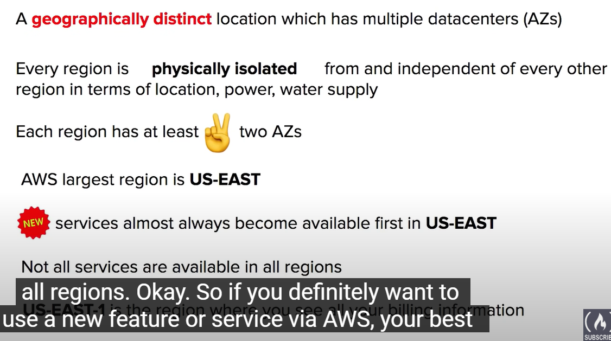

# 1 AWS Global Infrastructure

AWS Global Infrastructure is globally distributed hardware and data centers that are physically networked together to act as one large resource for the end customers

1:33:57 AWS Global Infrastructure Overview  
1:34:52 AWS Global Infrastructure Follow Along  
1:35:45 Regions  
1:38:09 Regions vs Global Services  
1:39:57 Availability Zones (AZs)  
1:42:35 Regions vs AZ Visualized  
1:43:42 Selecting Regions and AZs Follow Along  
1:47:13 Fault Tolerance  
1:50:44 AWS Global Network  
1:52:33 Points of Presence (PoP)  
1:53:36 Tier 1  
1:54:14 AWS Services using PoPs  
1:55:29 AWS Direct Connect  
1:56:52 Direct Connect Location  
1:57:26 AWS Local Zones  
1:58:56 Wavelength Zones  
1:59:59 Data Residency  
2:02:37 AWS for Government  
2:03:25 GovCloud  
2:04:51 AWS in China  
2:06:32 AWS in China Follow Along  
2:07:30 Sustainability  
2:09:20 Sustainability Follow Along  
2:10:35 AWS Ground Station  
2:11:54 AWS Outposts

## 1.1 Introduction and  Overview

The AWS Global Infrastructure is globally distributed hardware and data centers that are physically networked together to act as one large resource for the end customer.
This is so you, the customer, can access their services no matter where you are located around the globe.

-   30 Launched Regions​
-   96 Availability Zones​
-   115 Direct Connection Locations​
-   410+ Points of Presence​
-   25 Local Zones

https://aws.amazon.com/about-aws/global-infrastructure/regions_az/

---

### 1.1.1 References

-   [https://infrastructure.aws/](https://infrastructure.aws/)
-   [Global Infrastructure](https://aws.amazon.com/about-aws/global-infrastructure/)

## 1.2 Regions, AZ, Datacenters, Subnet 之间关系 

 

A region has multiple Availability Zones
An Availability Zone is made up of **one or more** data centers
All AZs in an AWS Region are interconnected with high-bandwidth, low-latency networking, over fully redundant, dedicated metro fiber providing high-throughput, low-latency networking between 
All traffic between AZs is encrypted
AZs are within 100 km (60 miles) of each other.

### 1.2.1 Selecting Regions and AZs Follow Along  
EC2: 创建一个 ec2 instance 的时候, 需要选 az
s3: 只用选 aws region, 不需要选 az

### 1.2.2 Regions

Region: a Geographically Distinct Location, which has multiple datacentres(AZs).

**Every region is physically isolated from and independent of every other region in terms of location, power, water supply**
-   Each region has at least two Availability Zones (AZs) ​
-   AWS US-EAST-1 (North Virginia) is the largest region​
-   New services almost always become available first in US-EAST​
-   Not all AWS Services are available in all regions​
-   All your billing information appears in US-EAST-1 (North Virginia)​
-   AWS is always looking to expand their footprint so new regions could be added in the upcoming years.​

You can head over to [AWS's Global Infrastructure](https://aws.amazon.com/about-aws/global-infrastructure/regions_az/?p=ngi&loc=2) page to learn more about Regions and see maps of their locations.
-   In the AWS Console you can change AWS Regions. Whatever AWS resources you launch will be in that region.​
-   Some AWS Services such as CloudFront operate in multiple regions and you’ll see the region change to Global ​

When you choose a region, there are four factors you need to consider:
1.  What Regulatory Compliance does this region meet?
2.  What is the cost of the AWS services in this region?
3.  What AWS services are available in this region?
4.  What is the distance or latency to my end-users?

Europa (Frankefurt) eu-central-1  是单独的一个 aws region . 里面 含有 几个 av Zone 
Europa (London )  eu-werst-1 是一个单独的 aws region. 面 含有 几个 av Zone 
Europa (Paris)  eu-werst-2 是一个单独的 aws region.  (和 eu-werst-2 不同 )

Region 的一些常见规律: 
Each Region generally hat 3 avaiabilty Zones

Four Factors has to be condesiderd during choosing a region there 

### 1.2.3 Regional Services vs Global Services  

**Regional Services**
AWS Scopes their AWS Management Console on a selected Region.
This will determine where an AWS service will be launched and what will be seen within an AWS Service's console
You generally don't explicitly set the Region for service at the time of the creation

**Global Services**
Some AWS Services operates across multiple regions and the region will be fixed to "Global"
E.g. Amazon S3, Cloud Front, Route53, IAM

For these global services at the time of creation:
-   There is no concept of region e.g. IAM User
-   A single region must be explicitly chosen e.g. S3 Bucket
-   A group of regions is chosen e.g. CloudFront Distribution

Regional Services: AWS scopes their aws Management Console On A selected Region
Global Services : Some AWS Services operate across multiple regions and the region will be fixed to Gloabl e.g. Amazon S3 , CloudFront, Route53 , IAM 

### 1.2.4 Availability Zones
Availability Zones are often referred to as `AZs`. An Availability Zone (AZ) is a physical location made up of one or more `datacenters`.​ A datacenter is a secured building that contains​ hundreds or thousands of computers. Datacenters within a region will be isolate from​ each other (different buildings). But they will​ be _close enough to provide low-latency (< 10ms)_.​

A region will _generally contain 3 Availability Zones​_.

The use of AZ’s give customers the ability to operate production applications and databases that are more:
-   Highly available
-   Fault tolerant
-   Scalable

Its common practice to run workloads in at least​ 3 AZs to ensure services remain available in case ​one or two datacenters fail **(High Availability)**.
-   **A subnet is associated with an Availability Zone**.​ So to launch an AWS resource into a specific AZ you need to launch your resource in a subnet that resides in that AZ.

A data center is a secured building that contains hundreds or thousands of computers
A Region will generally contain three availability zones. An Availability Zones contains one or more datacenter 

### 1.2.5 subnets and Availability Zones 关系 

## 1.3 Fault Tolerance  

It's up to the Cloud Service Provider (CSPs) to define the boundaries of a domain

An AWS Region would be a **Fault Level** → Fault Level us-east-1 (Region)

Each Amazon Region is designed to be completely **isolated** from the other Amazon Regions.

-   This achieves the greatest possible fault tolerance and stability

Each Availability Zone is isolated, but the Availability Zones in a Region are connected through low-latency links  
Each Availability Zone is designed as an independent failure zone

-   A ”Failure Zone” is AWS describing a Fault Domain.

**Failure Zone**

-   Availability Zones are physically separated within a typical metropolitan region and are located in lower risk flood plains
-   discrete uninterruptible power supply (UPS) and onsite backup generation facilities
-   data centers located in different Availability Zones are designed to be supplied by independent substations to reduce the risk of an event on the power grid impacting more than one Availability Zone.
-   Availability Zones are all redundantly connected to multiple tier-1 transit providers

**Multi-AZ for High Availability**

If an application is partitioned across AZs, companies are better isolated and protected from issues such as **power outages, lightning strikes, tornadoes, earthquakes**, and more.

-----

- Fault Domain
    - A fault domain is so a fault domain is a section of a network that is vulnerable to damage if a critical device or system fails.  
    - The purpose of a fault domain is that if a failure occurs it will not cascade outside that domain limiting the possible damage
    - A fault domain is a section of a network that is vulnerable to damage if a critical device or system fails. The purpose of a fault domain is that if a failure occurs it will not cascade outside that domain, limiting the damage possible.
    - You can have fault domains nested inside fault domains.
- The Scope of a fault domain
    - 
    - specific servers in a rack
    -  an entire rack in a datacenter
    -  an entire room in a datacenter
    -  the entire data center building

- Fault Level
    - A Fault level is a collection of fault domains . 
- Fault level and Fault domain in AWS
    - 

- The Isolation of Fault level and Fault Domain 
    - Each amazon region is designed to be completely isolated from the other amazon region. they achieved this with the greatest possible fault tolerance and stability
    - Each availability zone is also isolated but the availability zone in a region are connected through low-latency links
    - Each availability zone is designed as an independent failure zone 
- Fault Zone in AWS ( = Fault Domain ) 
    - A ”Failure Zone” is AWS describing a Fault Domain.
    - 
    -  Availability Zones are physically separated within a typical metropolitan region and are located in lower risk flood plains
    -   discrete uninterruptible power supply (UPS) and onsite backup generation facilities
    -   data centers located in different Availability Zones are designed to be supplied by independent substations to reduce the risk of an event on the power grid impacting more than one Availability Zone.
    -   Availability Zones are all redundantly connected to multiple tier-1 transit providers
- Multi-AZ for High Availability 
    - If an application is partitioned across azs companies are better isolated and protected from issues such as power outages lightning strikes tornadoes earthquakes and more 

[Global Infrastructure](https://docs.aws.amazon.com/whitepapers/latest/aws-overview/global-infrastructure.html)

[Describing fault domains.](https://lethain.com/fault-domains/)

[Fault Domain Awareness](https://mesosphere.github.io/marathon/docs/fault-domain-awareness.html)

[Fault Domains and the Vegas Rule](https://m.subbu.org/fault-domains-and-the-vegas-rule-923fc037119)

 
## 1.4 AWS Global Network and Edge Locations

Global network represents interconnections between aws global infrastructure
Global network  is a private Expressway, where things can move very fast between data centers 

- **AWS Global Accelerator**
- **AWS S3 Transfer Acceleration**
    - Uses Edge Locations as an on-ramp to quickly reach AWS resources in other regions by traversing the fast AWS Global Network
- **Amazon CloudFront (CDN)**
    - Uses Edge Locations as an off-ramp, to provide at the Edge storage and compute near the end-user.
- **VPC Endpoints**
    - Ensuring your resources stay within the AWS Network and do not traverse over the public Internet.

[Global Network](https://aws.amazon.com/about-aws/global-infrastructure/global_network/)

# 2 Edge Location

- Edge Locations
    - Edge Location is on and off ramps (进出高速路的 辅道 ) to aws global Network 
    - On-ramp
        - use edge locations as an on-ramp to quickly reach AWS's resources and other regions by traversing the fast away global network
        - 比如 aws global accelerator , AWS s3 transfer acceleration 就是用的这样的功能那个. 
    - Off-ramp
        - Uses Edge Locations an off-ramp,  to provide an at the edge storage and compute near the end user. 
        - 比如  Amaozn CloudFront (CDN) 用的就是这个功能 
    - VPC Endpoints: Ensuring you resources stay within the AWS network and do no traverse over the public Internet 

## 2.1 Points of Presence (PoP)  

PoP 就是 a location between AWS region and the end userr. 
Pop 这个 location 就是 datacenter 
Pop 中的 resource 是 
- Edge Locations : the data Centers that hold cached on the most popular files 
- Regional Edge Locations :  the data Centers that hold much larger caches of less popluar  
- Regional Edge Caches 

**Points of Presence (PoP)** are intermediate locations between an AWS Region and the end-user, and this location could be a datacenter or collection of hardware.​
-   For AWS a Point of Presence is a data center owned by AWS or a trusted partner that is utilized by AWS Services related for content delivery or expediated upload.​

[**Edge Locations**](https://aws.amazon.com/cloudfront/features/) - are datacenters that hold cached (copy) on the most popular files (eg. web pages, images and videos) so that the delivery of distance to the end users are reduce
[**Regional Edge Cache**](https://docs.aws.amazon.com/AmazonCloudFront/latest/DeveloperGuide/HowCloudFrontWorks.html#CloudFrontRegionaledgecaches) - are datacenters that hold much larger caches of less-popular files to reduce a full round trip and also to reduce the cost of transfer fees.​

### 2.1.1 Tier 1 in Network  and PoPs 储存在哪里

PoPs live at the edge/Intersection of two networks
Pier one networks is a network that can reach every other network on th on internet without purchasing ip transit or paying for peering 
PoPs 用来 for Content Delivery and Expediated Upload

**Tier 1 network** is a network that can reach every other network on the Internet **without purchasing IP transit or paying for peering**.
AWS Availablity Zones are all redundantly connected to multiple **tier-1 transit providers**
AWS availability zones are all redundantly connected to multiple tier 1 transit providers

### 2.1.2 AWS Services using PoPs  
PoPs 用来 for Content Delivery and Expediated Upload  
将 数据 上传到 edge Location. 然后用来 方便 user 快速 从 edge location 中 访问数据

[Global Infrastructure](https://aws.amazon.com/about-aws/global-infrastructure/)

The following AWS Services use PoPs for content delivery or expediated upload.
- Amazon Cloud ist a Content Delivery Network (CDN) Services 
    - Point you website toCloudFornt, 这样 当访问这个 website 的时候, 就会 route request to nearest Edge Location Cache 
    - origin (就是 web-server) 的东西 会被cached , 到 Edge Location Cache , 然后 可以被 其他的 edge Locations 访问 
    -  You point your website to CloudFront so that it will route requests to nearest Edge Location cache
    -   allows you to choose an **origin** (such as a web-server or storage) that will be source of cached
    -   caches the contents of what origin would returned to various Edge Locations around the world
-  Amazon S3 Transfer Acceleration 
    - 给你一个快速 url , 用户 勇者 url 就可以将文件 上传到 edge Location.  上传到 edge Location 的文件就可以被 快速访问. 
    - **Amazon S3 Transfer Acceleration** allows you to generate a special URL that can be used by end users to upload files to a nearby Edge Location. Once a file is uploaded to an Edge Location, it can move much faster within the AWS Network to reach S3.
- AWS Global Acceleratior
    - can  find a  optimal path from the end user to your web-server 
    - 给 user 让他到 Edge location , 而不是直接访问 web-application
    - **AWS Global Accelerator** can find the optimal path from the end user to your web-servers. Global Accelerator are deployed within Edge Locations so you send user traffic to an Edge Location instead of directly to your web-application.

## 2.2 AWS Direct Connect  and AWS Direct Locations

[AWS Direct Connect](https://aws.amazon.com/directconnect/)
[AWS Direct Connect connections](https://docs.aws.amazon.com/directconnect/latest/UserGuide/WorkingWithConnections.html)

### 2.2.1 AWS Direct Connect 
- It is a private dedicated connection between your data center, office, co-location and Aws 
- A co-location (aka carrier-hotel) is a data center where equipment, space, and bandwidth are available for rental to retail customers
- It helps reduce network costs increase bandwidth throughput: great for high traffic networks 
- it provides a more consistent network experience than a typical internet-based connection: reliable and secure 

**Direct Connect** has these **very-fast network** connection options:

-   Lower Bandwidth 1 Gbps
-   Higher Bandwidth 10 Gbps or 100 Gbps

### 2.2.2 AWS Direct Locations (就是 data center )
[**Direct Connect Locations**](https://aws.amazon.com/directconnect/features/#AWS_Direct_Connect_Locations) - are `trusted third-party datacenters` that you can establish a dedicated high speed, low-latency connection from your on-premise to the AWS network.​
-   DirectConnect connections are always established through a `third-party provider`. These APN (Amazon Partner Network) Partners can help you establish network circuits between an AWS Direct Connect location and your datacenter, office, or colocation environment, or assist you in constructing a hybrid environment.
- are trusted data centers that you can establish a dedicated high-speed low-latency connection from your on-premise to aws 
- use the aws Direct direct connect service to order and establish a connection

## 2.3 AWS Local zones and Wavelength Zones  (就是 data center, WZ支持5G )

### 2.3.1 AWS Local zones
- Local zones are deta centers located vert close to a densely popluated area to provide single-digit milisecond low latency performance for that area 
- [**Local Zones**](https://aws.amazon.com/about-aws/global-infrastructure/localzones/) - are `datacenters` located very close to a density populated area to provide _single-digit millisecond low latency performance_ (eg. 7ms) for that area.
- Local zones 存在的 目的: Support highly-demanding applications sensitive to latencies  
 

**Los Angeles, California** was the first Local Zone to be deployed​
-   It is a logical extension of the `US-West Region​`
-   The Identifier looks like the following: us-west-2-lax-1a​
-   Only specific AWS Services have been made available​
    -   EC2 Instance Types (T3, C5, R5, R5d, I3en, G4)​
    -   EBS (io1 and gp2)​
    -   Amazon FSx​
    -   Application Load Balancer​
    -   Amazon VPC​

**The purpose of Local Zone is to support highly-demanding applications sensitive to latency:​**
-   Media & Entertainment​
-   Electronic Design Automation​
-   Ad-Tech​
-   Machine Learning

### 2.3.2 Wavelength Zones 
- allows for edge computing on 5G Network.   
- Application have ultra-low latency being as close as possible to the users 
- you will create a subnet tied to a wavelength zone and then and just think of it as like an availability zone. but it's a wavelength zone and then you can launch your vm  to the edge of the targeted 5g network 
- Example: that's the network you're using aws to deploy an ec2 instance and then whenusers connect to you know those radio towers those cell towers, they're going to be routed to you know nearby hardware that is running those virtual machines okay 

## 2.4 Data Residency  
- Data Residency
- Compliance Boundaries
- Data Sovereigenty

**What is Data Residency?**
The physical or geographic location of where an organization or cloud resources reside.

**What is Compliance Boundaries?**
A regulatory compliance (legal requirement) by a government or organization that describes where data and cloud resources are allowed to reside

**What is Data Sovereignty?**
Data Sovereignty is the jurisdictional control or legal authority that can be asserted over data because its physical location is within jurisdictional boundaries

[Addressing Data Residency with AWS](https://aws.amazon.com/blogs/security/addressing-data-residency-with-aws/)

用到的 AWS Services
For workloads that need to meet compliance boundaries strictly defining the data residency of data and cloud resources in AWS you can use: 
- AWS Config
    - **AWS Config** is a Policy as Code service.
    - You can create rules to continuously check AWS resources configuration. If they deviate from your expectations you are alerted or AWS Config can in some cases auto-remediate.
- AWS Outposts (就是 physicals servers)
    - **AWS Outposts** is a **physical rack of servers** that you can put in your data center. Your data will reside whenever the Outpost Physically resides
- IAM Polices 
    - **IAM Policies** can be written explicitly to deny access to specific AWS Regions. A Service Control Policy (SCP) are permissions applied organization-wide.
- Services Control Policy (SCP)
    - if you wanted to have it organizational wide across all of your aws accounts you can use something called a service control policy
    -  A global media company uses AWS Organizations to manage multiple AWS accounts. Which AWS service or feature can the company use to limit the access to AWS services for member accounts? 答案是 Services Control Policy

## 2.5 AWS for Government  and AWS GovCloud Regions

Public sectors include public goods and governmental services such as:
-   military
-   law enforcement
-   infrastructure
-   public transit
-   public education
-   health care
-   the government itself

AWS can be utilized by the public sector or organizations developing cloud workloads for public sector
AWS achieve this by meeting **regulatory compliance programs** along with specific governance and security controls
AWS has special regions for US regulation called **GovCloud**
 
 

AWS GovCloud Regions

[**AWS GovCloud**](https://docs.aws.amazon.com/govcloud-us/latest/UserGuide/whatis.html) Regions allow customers to host sensitive **Controlled Unclassified Information** and other types of regulated workloads.

-   GovCloud Regions are only operate by employees who are `U.S. citizens on U.S. soil`.
-   Only accessible to U.S. entities and account state holders who pass a screening process.
-   Customers can architect secure cloud solutions that comply with:
    -   Fed**RAMP** High baseline
    -   DOJ's Criminal Justice Information Systems (CJIS) Security Policy
    -   U.S. International Traffic in Arms Regulations (TAR)
    -   Export Administration Regulations (EAR)
    -   Department of Defense (DoD) Cloud Computing Security Requirements Guide

**GovCloud Regions are currently only in the US.**
-   You can view their regions on [AWS Map of Regions and Edge Networks.](https://aws.amazon.com/about-aws/global-infrastructure/regions_az/?p=ngi&loc=2)
-   You can view more about GovCloud on the official [AWS GovCloud page.](https://aws.amazon.com/govcloud-us/?whats-new-ess.sort-by=item.additionalFields.postDateTime&whats-new-ess.sort-order=desc)

 
## 2.6 AWS in China  

- aws global 和 aws china 是两个东西
- aws china 里的东西, 不能和外网 interact
- Not all Sercices are available in China, like Route 53 

AWS China is the AWS cloud offerings in Mainland China.
AWS China is completely isolate intentionally from AWS Global to meet regulatory compliance for Mainland China.
AWS China is on its own domain at: amazonaws.cn

In order to operate in a AWS China Region you need have a Chinese Business License (ICP license) Not all services are available in china eg. Route53 Running in Mainland China (instead of Singapore) means you would not need to traverse the The Great Firewall.

AWS has two Regions in Mainland China:
**Ningxia** CN-NorthWest-1 Operated by NSWCF
**Beijing** CN-North-1 operated by SINNET

[My experience with AWS China](https://www.teracloud.io/single-post/2019/10/24/My-experience-with-AWS-China)
[AWS China](https://www.amazonaws.cn/en/)

## 2.7 Sustainability  (环保)
Amazon co-founded the Climate Pledge to achieve Net-Zero Carbon Emissions by 2040 across all of Amazon’s business (this includes AWS)
- Renewable Energy
- Cloud Efficiency
- Water stewardship

AWS Cloud’s Sustainability goals are composed of three parts:

**1. Renewable Energy**
AWS is working towards having its AWS Global Infrastructure powered by 100% renewable energy by 2025.
AWS purchases and retires environmental attributes to cover the non-renewable energy for AWS Global Infrastructure:
-   Renewable Energy Credits (RECs)
-   Guarantees of Origin (GOs)

**2. Cloud Efficiency**
AWS’s infrastructure is 3.6 times more energy-efficient than the median of U.S. enterprise data centers surveyed.

**3. Water Stewardship**
Direct evaporative technology to cool our data center Use of non-potable water for cooling purposes (recycled water)
On-site water treatment allows us to remove scale-forming minerals and reuse water for more cycles Water efficiency metrics to determine and monitor optimal water use for each AWS Region

2:09:20 Sustainability Follow Along  

## 2.8 AWS Ground Station   (天阵信号器)

**AWS Ground Station** is a fully managed service that **lets you control satellite communications**, process data, and scale your operations without having to worry about building or managing your own ground station infrastructure
- lets you control stellite communucations, process dta , and scale your operations

Use cases for Ground Station:
-   weather forecasting
-   surface imaging
-   communications
-   video broadcasts

To use Ground Station:
-   You schedule a Contact (select satellite, start and end time, and the ground location
-   use the AWS Ground Station EC2 AMI to launch EC2 instances that will uplink and downlink data during the contact or receive downlinked data in an Amazon S3 bucket.

Use Case:
A company reaches an agreement with a Satellite Imagery Provider to take satellite photos of a specific region. They use AWS Ground Station to communicate that company’s Satellite and download the S3 image data.
The Company you've reached an agreement with a satellite image provider to use their satellites to take photos for a specific region or time.  You are using aws ground station to communicate to that company satellite and download that as that image data to your s3 bucket

[AWS Ground Station](https://aws.amazon.com/ground-station/)

## 2.9 AWS Outposts  (定制 servers 的服务)
- 定制 servers 的服务
- AWS's outposts and this is a fully managed service that offers the same ableist infrastructure services, APIs tools to virtually any data center co-location space or on-premise facility for a truly consistent hybrid experience
- AWS Outposts is rack of servers running aws infrastructure on your physical location

[AWS Outposts](https://aws.amazon.com/outposts)

Server Rack and Rack Heights
**What is a Server Rack?**
A frame design to hold and organize IT equipment.

**Rack Heights**
U stands for “rack units” or “U spaces” with is equal to 1.75 inches. The industry standard rack size is 48U (7 Foot Rack)
 full-size rack cage is 42U high
-   equipment is typically 1U, 2U, 3U, or 4U high

AWS Outposts 的 定制的 机架的大小

