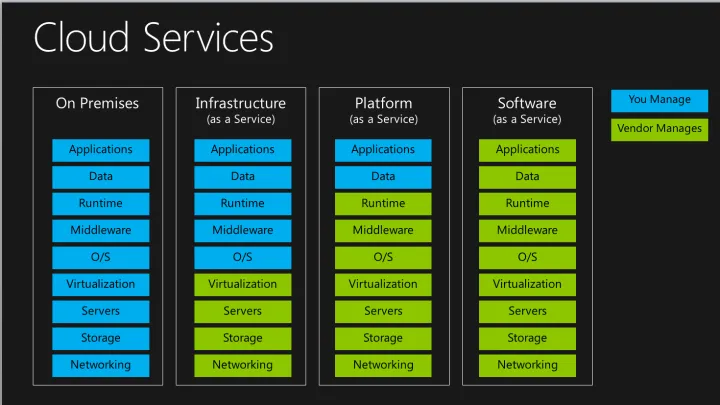

17:35 What is Cloud Computing?
18:19 Evolution of Cloud Hosting
21:13 What is Amazon?
22:46 What is AWS?
25:28 What is a Cloud Service Provider (CSP)?
27:24 Landscape of CSPs
30:05 Gartner Magic Quadrant for Cloud
33:28 AWS Services Preview
34:52 Evolution of Computing
40:00 Types of Cloud Computing
44:53 Cloud Computing Deployment Models

# 1 What is Cloud Computing?

cloud computing is the practice of using a network of remote servers hosted on the internet to store manage and process data rather than a local server or personal computer

On-premises 和 Cloud Providers的区别

# 2 Evolution of Cloud Hosting

# 3 What is AWS

# 4 Cloud Service Provider (CSP) and Landscape of CSPs
Cloud Service Provider (CSP) ist a company 

Cloud Service Provider (CSP)  和 cloud platform 的区别: 
if a company offers multiple cloud services under a single ui but do not meet most or all of these requirements, it would just be referred to as a cloud platform so when you hear about twilio or hashicorp or databricks

Landscape of CSPs 的介绍 

# 5 Gartner Magic Quadrant for Cloud

魔力象限（Magic Quadrant）是Gartner公司开发的一种图形化的市场分析工具，它是将一个特定技术市场的参与者（供应商）按照不同的市场表现放入到坐标轴的四个象限，以此来评估一个特定技术市场中的供应商和产品

# 6 Common Cloud Services  and  Technology Overview 

4 core Cloud services
- Cloud Compute
- Cloud Networking
- Cloud Storage 
- Cloud Databases 

Cloud Computing can be used to refer to all categories, even though it has Compute in the name

Cloud Service Provider  对应提供的 4 core cloud services: 
Cloud Service Provider (CSPs) that are Infrastructure as a Service (laaS) will always have 4 core cloud service offerings

# 7 Evolution of Computing
Dedicated Server -> Virtual Machine -> Containers -> Functions 

1 Dedicated Server 

2 Virtual Machine

 
3 Containers
确定是 a lots of work for maintan

4 Functions

Cold Starts:  where the virtual machine has to spin up and so sometimes requests can be a bit slow so there's a bit of trade-off

# 8 Six Advantages and Benefits of Cloud Computing

# 9 Types of Cloud Computing
如果你是一个网站站长，想要建立一个网站。不采用云服务，你所需要的投入大概是：买服务器，安装服务器软件，编写网站程序。
现在你追随潮流，采用流行的云计算，
- 如果你采用IaaS服务，那么意味着你就不用自己买服务器了，随便在哪家购买虚拟机，但是还是需要自己装服务器软件
- 而如果你采用PaaS的服务，那么意味着你既不需要买服务器，也不需要自己装服务器软件，只需要自己开发网站程序
- 如果你再进一步，购买某些在线论坛或者在线网店的服务,这意味着你也不用自己开发网站程序，只需要使用它们开发好的程序，而且他们会负责程序的升级、维护、增加服务器等，而你只需要专心运营即可，此即为SaaS。

IaaS（Infrastructure as a service – 基础设施即服务）：用户可以在云服务提供商提供的基础设施上部署和运行任何软件，包括操作系统和应用软件。用户没有权限管理和访问底层的基础设施，如服务器、交换机、硬盘等，但是有权管理操作系统、存储内容，可以安装管理应用程序，甚至是有权管理网络组件。简单的说用户使用IaaS，有权管理操作系统之上的一切功能。我们常见的IaaS服务有虚拟机、虚拟网络、以及存储。

PaaS（Platform as a service – 平台即服务）：PaaS给用户提供的能力是使用由云服务提供商支持的编程语言、库、服务以及开发工具来创建、开发应用程序并部署在相关的基础设施上。用户无需管理底层的基础设施，包括网络、服务器，操作系统或者存储。他们只能控制部署在基础设施中操作系统上的应用程序，配置应用程序所托管的环境的可配置参数。常见的PaaS服务有数据库服务、web应用以及[容器服务](https://www.zhihu.com/search?q=%E5%AE%B9%E5%99%A8%E6%9C%8D%E5%8A%A1&search_source=Entity&hybrid_search_source=Entity&hybrid_search_extra=%7B%22sourceType%22%3A%22answer%22%2C%22sourceId%22%3A743669668%7D)。成熟的PaaS服务会简化开发人员，提供完备的PC端和移动端软件开发套件（SDK），拥有丰富的开发环境（Inteli、Eclipse、VS等），完全可托管的数据库服务，可配置式的应用程序构建，支持多语言的开发，面向应用市场。

SaaS（Software as a Service – [软件即服务](https://www.zhihu.com/search?q=%E8%BD%AF%E4%BB%B6%E5%8D%B3%E6%9C%8D%E5%8A%A1&search_source=Entity&hybrid_search_source=Entity&hybrid_search_extra=%7B%22sourceType%22%3A%22answer%22%2C%22sourceId%22%3A743669668%7D)）：SaaS给用户提供的能力是使用在云基础架构上运行的云服务提供商的应用程序。可以通过轻量的客户端接口（诸如web浏览器（例如，基于web的电子邮件））或程序接口从各种客户端设备访问应用程序。 用户无需管理或控制底层[云基础架构](https://www.zhihu.com/search?q=%E4%BA%91%E5%9F%BA%E7%A1%80%E6%9E%B6%E6%9E%84&search_source=Entity&hybrid_search_source=Entity&hybrid_search_extra=%7B%22sourceType%22%3A%22answer%22%2C%22sourceId%22%3A743669668%7D)，包括网络，服务器，操作系统，存储甚至单独的应用程序功能，可能的例外是有限的用户特定应用程序配置设置。类似的服务有：各类的网盘(Dropbox、百度网盘等)，JIRA，GitLab等服务。而这些应用的提供者不仅仅是云服务提供商，还有众多的第三方提供商（ISV: independent software provider）。

# 10 Cloud Computing Deployment Models

f