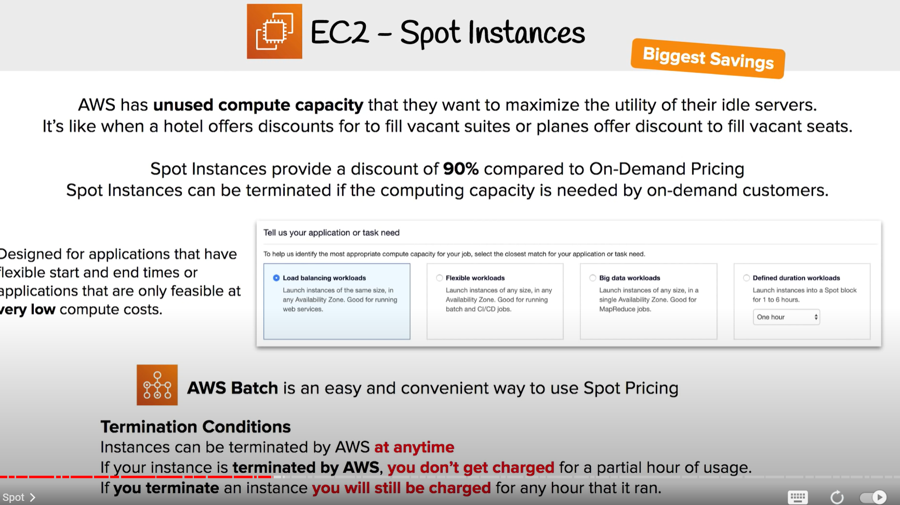
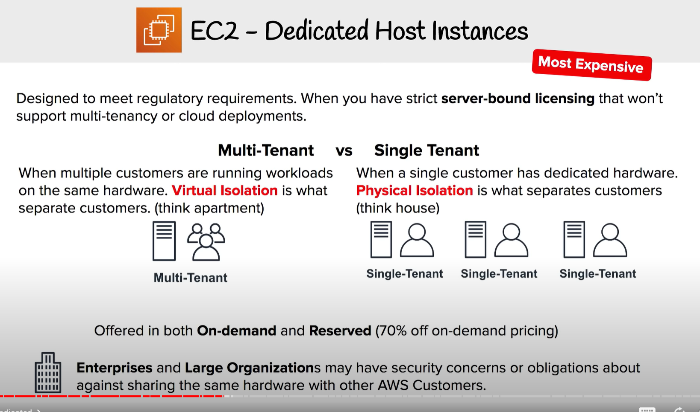

7:49:09 EC2 Pricing Models
7:51:18 On Demand
7:52:51 Reserved
7:56:07 RI Attributes
7:57:02 Regional and Zonal RI
7:58:18 RI Limits
7:59:24 Capacity Reservations
8:00:38 Standard vs Convertible RI
8:01:45 RI Marketplace
8:03:00 Spot
8:04:20 Dedicated
8:06:14 Savings Plan

# 1 Introduction

# 2 On-Demand Instances 

# 3 Reserved Instances (RI)

RI attribute: like ec2 instance type 

# 4 Spot Instances

# 5 Dedicated Host Instance 

Can be untilized / offerd  (Multi-Tenant vs Single Tenant)  in On-Demand Instances and Reserved Instances (up to 70% off)

# 6 EC2 Pricing CheatSheet

