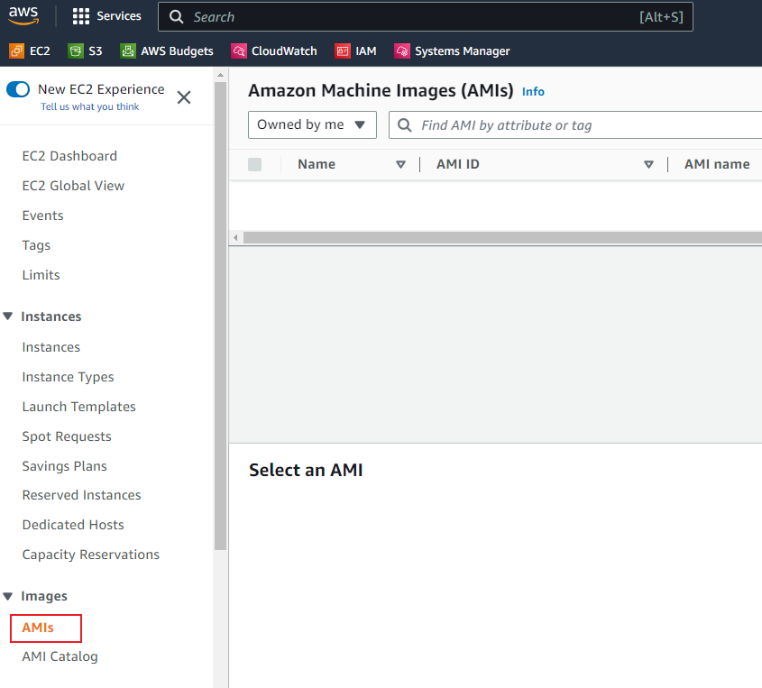
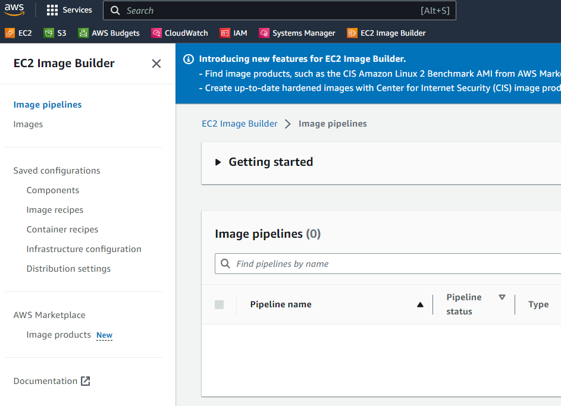
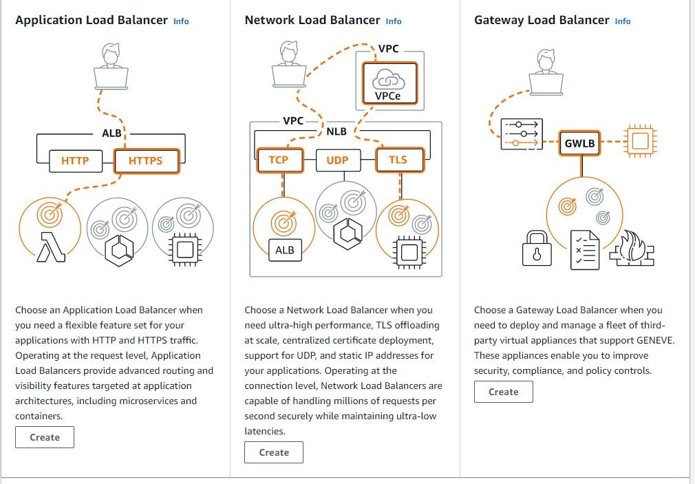

# 1 Elastic Cloud Compute (EC2)

# 2 Sessions Manager
Access the server in EC2

# 3 Amazon Machine Image (AMI)

EC2 Image Builder
 

# 4 Auto Scaling Groups
ensure 任意一个 a server of a server server is running
当 需求量大的时候, add a more server, 当网站点击需求小的时候, remove servers to meet the demand

Scailng policies are ways rules that you can use to determine how the auto scaling group should react to changes within its environment 
- more CPU utilization: spin up servers 

# 5 Elastic Load Balancer (ELB)
put load balancer in front of your instance 
traffic flow through instnces and Load Balancer  distribute that traffic to multiple instances 
If a AZ not available, so you traffic will you to another AZ where you have an instance running 

Three type of load Balancer 

# 6 S3

# 7 CloudFront
Cloud Front is used as content distribution network (CDN)
like, you want to share a video, a static content,.  and make the shortest route to the end user, it's going to then copy it to multiple edge locations around world 

Each created CloudFront Distribution has a Domain Name and a port. Your Traffic would hit this domain name and then it would route your traffic to the nearest edge location 

# 8 Relational Database Service (RDS)

# 9 Lambda

# 10 WatchCloud
Cloud 执行一些任务后, 产生一些 log 文件  就在这里面可以看到 
