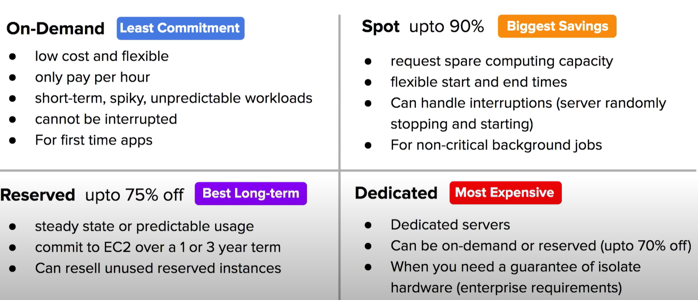
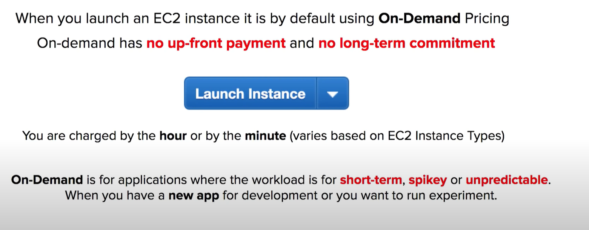
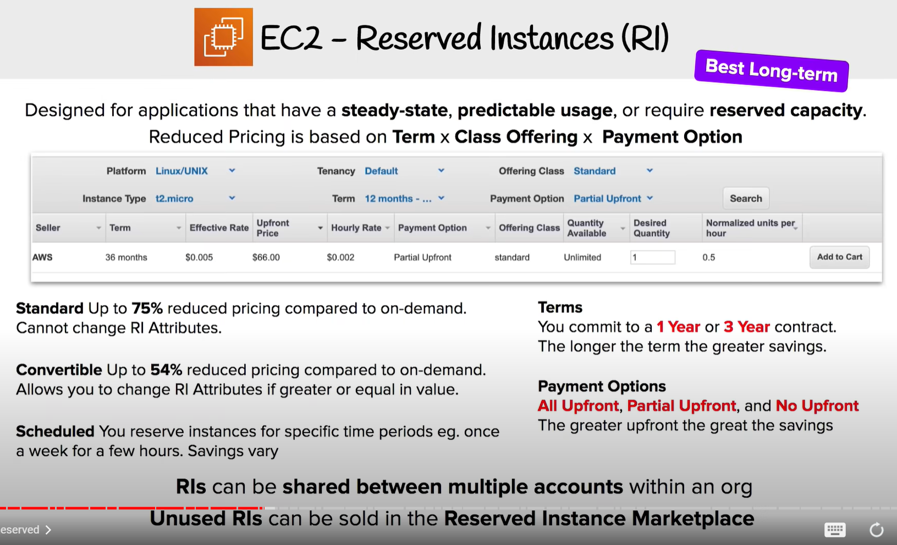
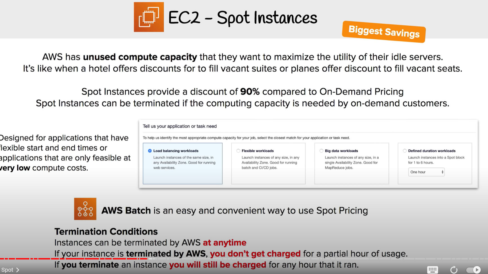
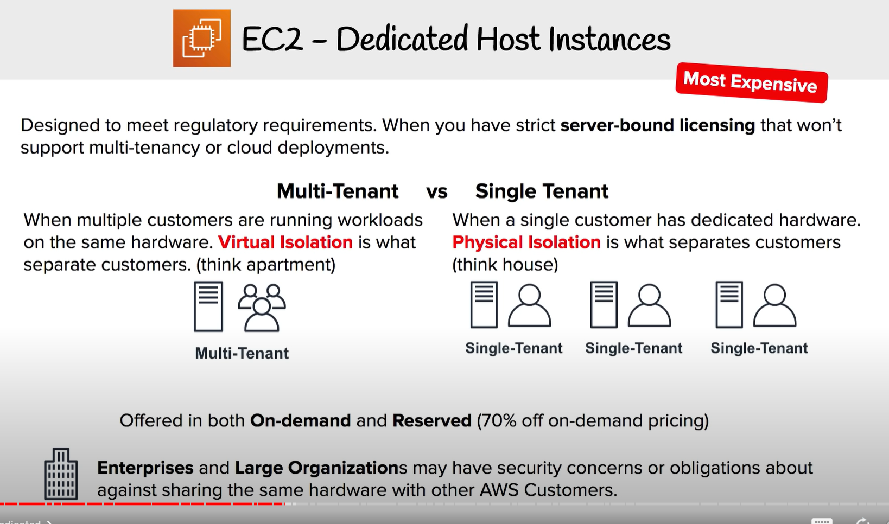
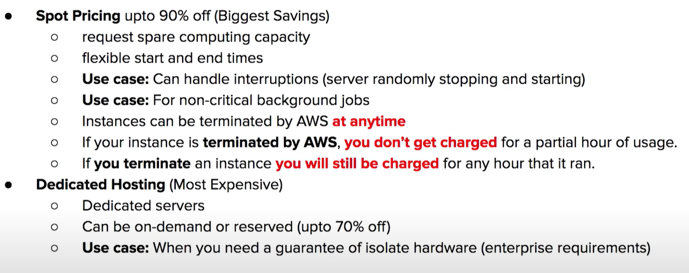

# 1 Introduction

# 2 On-Demand Instances 

# 3 Reserved Instances (RI)

RI attribute: like ec2 instance type 

# 4 Spot Instances

# 5 Dedicated Host Instance 

Can be untilized / offerd  (Multi-Tenant vs Single Tenant)  in On-Demand Instances and Reserved Instances (up to 70% off)

# 6 EC2 Pricing CheatSheet

