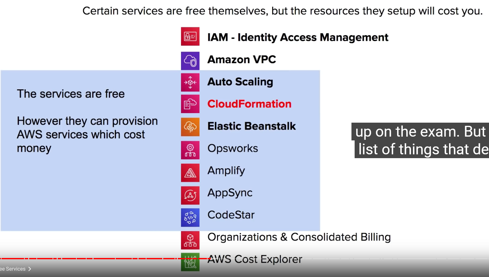
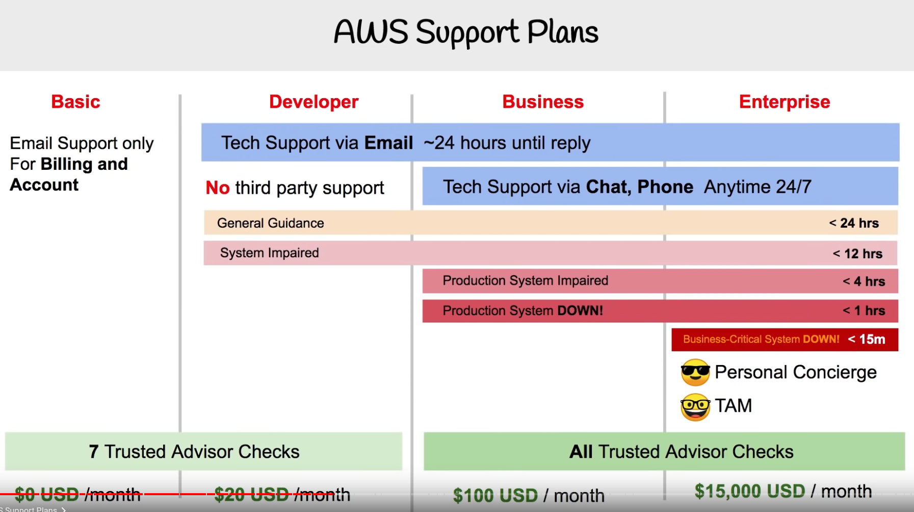
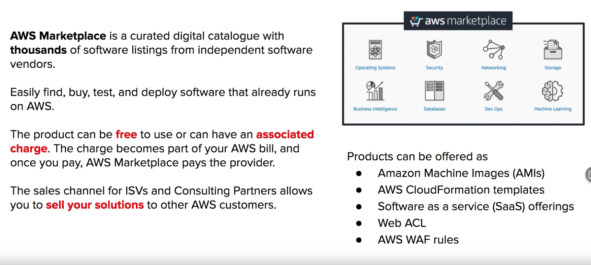
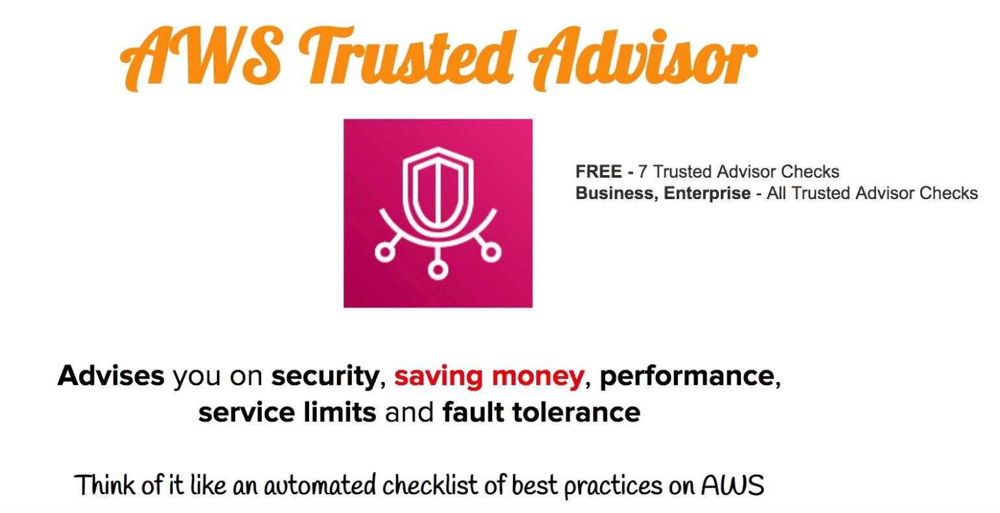
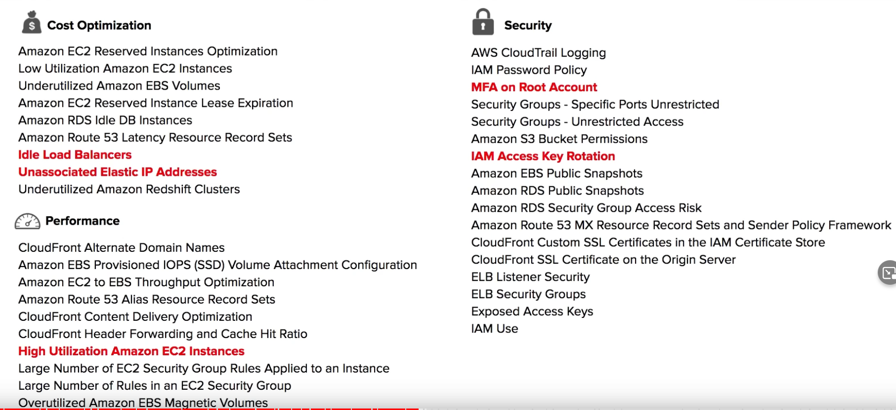
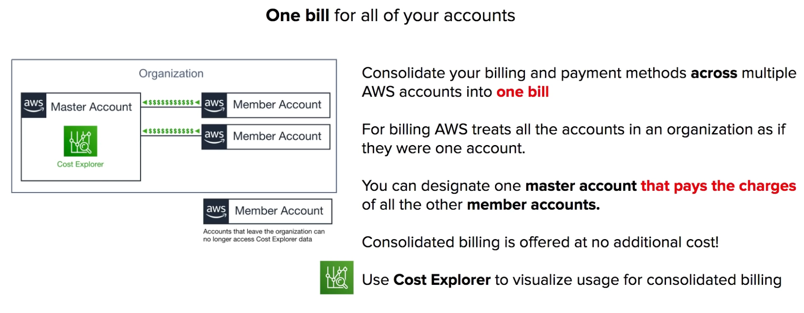
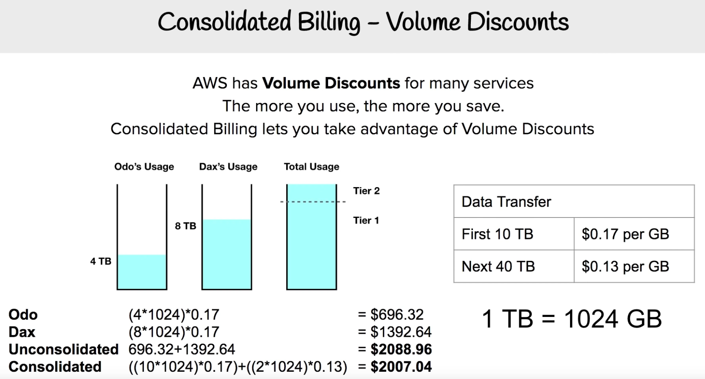

# 1 Free Services
那些服务是免费的

# 2 AWS Support Plans

aws 人员会帮助你, 帮你解答 问题, 
Third party support: like Django, rails 

 Follow Along - Lets create a support case

# 3 AWS Marketplace

3.1 Follow Along - Marketplace subscription

# 4 AWS Trusted Advisor

 

这个 Advisor 并不是真人, 而是 一种服务. 告诉你在 topic 下面, 你可以优化什么

⌨️ (1:54:13) Follow Along Trusted Advisor

# 5 Consolidated Billing

## 5.1 Consolidated Billing:  Volume Discounts

⌨️ (1:58:36) AWS Cost Explorer
⌨️ (2:00:16) AWS Cost Explorer Follow Along
⌨️ (2:04:16) AWS Budgets
⌨️ (2:06:31) AWS Budgets Follow Along
⌨️ (2:10:24) TCO Calculator
⌨️ (2:11:20) TCO Calculator Follow ALong
⌨️ (2:14:44) AWS Landing Zone
⌨️ (2:17:28) Resource Groups and Tagging
⌨️ (2:18:37) Resource Groups Follow Along
⌨️ (2:23:40) AWS QuickStart
⌨️ (2:26:48) AWS Cost and Usage Report
⌨️ (2:27:32) Cost and Usage Follow Along