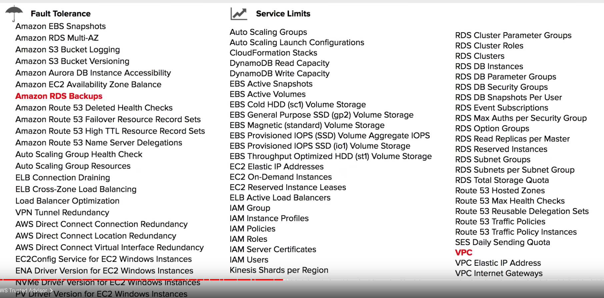

# 1 Free Services
那些服务是免费的

# 2 AWS Support Plans

aws 人员会帮助你, 帮你解答 问题, 
Third party support: like Django, rails 

 Follow Along - Lets create a support case

# 3 AWS Marketplace

3.1 Follow Along - Marketplace subscription

# 4 AWS Trusted Advisor

 

这个 Advisor 并不是真人, 而是 一种服务. 告诉你在 topic 下面, 你可以优化什么

⌨️ (1:54:13) Follow Along Trusted Advisor

# 5 Consolidated Billing

## 5.1 Volume Discounts

# 6 AWS Cost Explorer

对应的服务是 aws cost management 

visualize, understand, manage yout aws costs and usage over time 

## 6.1 AWS Cost Explorer example

What is "EC2-Other" filter in "Cost Explorer" dashboard mean? 
https://stackoverflow.com/questions/56869952/what-is-ec2-other-filter-in-cost-explorer-dashboard-mean

Costs for EC2-Other include things such EBS, Data transfer, Load Balancers, etc.
If you'd really want to check internally what you're being charged for, go to "Cost Explorer", select the monthly cost report, filter on the right the "EC2-Other" service, and group by "Usage Type"

# 7 AWS Budgets

## 7.1 AWS Budgets Follow Along

# 8 Resource Groups and Tagging
给 aws resources 加上自己的设置的 tag, 这样 那些 share one or more tags 的 resources 就被铅刀同一个 resource Groups 中了 

## 8.1 Example: group ec2 

1 创建新的 ec2 , 在创建的时候 填入tag

2 create  resource groups

3 tag Editor ( 用来 manage tag)
通过这个界面 给 某个 resource group 中的所有 elements 加上一个新的 tag

=== 下面的这些都有独立的页面, 属于 aws 主 services 页面中的一员

# 9 TCO Calculator (Total Cost of ownership)
可以估算 如果你把你的系统 从 on-premise 迁移到 aws, 你能省多少钱 

## 9.1 TCO Calculator 的例子

# 10 AWS Landing Zone
有比较贵的 upfront cost. 
适合大企业, 不适合 中小型的 startup 
提供 baseline environment.   g给他们提供帮助, 帮助这些企业 去建设 多 aws account 的记过 

主页:  

## 10.1 AWS Solution: Multi-Account Structure 

## 10.2 AWS Solution: Account Vending Machine

# 11 AWS QuickStart
使用 quickstart temple 帮客户按照一个预定好的 template 去 deploy  一个 stock, 由若干个server 组成 

## 11.1 例子

# 12 AWS Cost and Usage Report
用这个服务可以生成一个 csv, 里面有 关于 花费的情况 .  
这个csv  必须导入到 S3,  然后 利用 aws 中的 其他功能 可以将 这个 表 视觉化出来 

## 12.1 例子 

生成的 excel 自动存在 s3 中 

